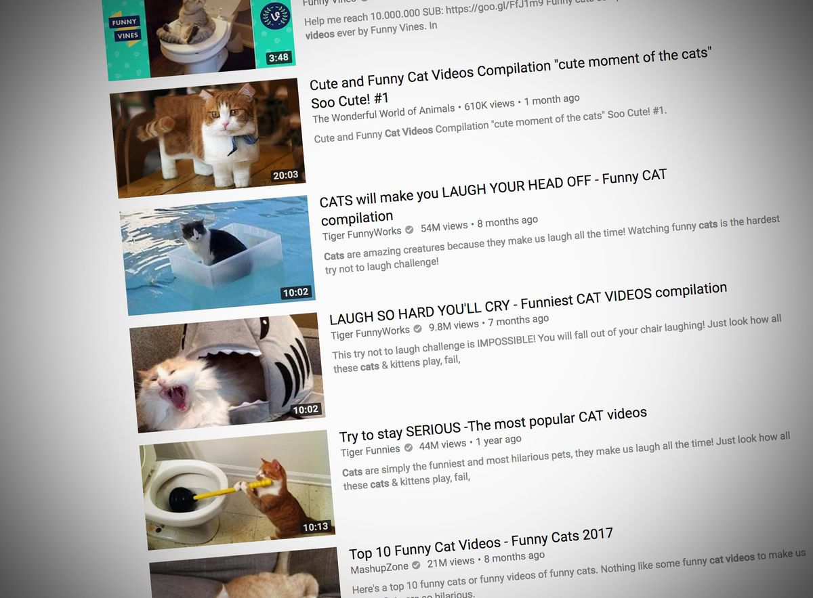

MICROSOFT DIZ QUE OS MEMES ESTÃO ACABANDO COM A SUA PRODUTIVIDADE
-----------------------------------------------------------------

.. figure:: estresse.jpg
    :scale: 60 %
    :align: center

Há um senso comum de que tecnologia aumentaria a produtividade da humanidade. Contudo, alguns especialistas acreditam no contrário, segundo a `Bloomberg <https://www.bloomberg.com/news/articles/2018-02-05/microsoft-says-it-s-true-cat-videos-distract-workers>`_. O veículo nota que algumas economias até estagnaram ou tiveram declínio de produtividade com a ascensão da tecnologia.

Agora, uma nova pesquisa da Microsoft com 20 mil participantes tentou ir mais a fundo nesse paradigma. O resultado, logo de cara, 'reconhece que a nova tecnologia digital pode, em algumas circunstâncias, tornar seu negócio menos produtivo'.

Como a Bloomberg nota, a Microsoft parece estar se encaminhando pela mesma tendência de outras empresas de tecnologia que questionam os benefícios de um mundo conectado. O Facebook, por exemplo, admitiu recentemente que a rede social poderia até causar problemas psicológicos.

Entre os problemas notados pela Microsoft durante a pesquisa, estão:

- Distração pelo fluxo constante de emails;
- Mensagens de slack;
- Notificações no Trello;
- Mensagens de texto e tweets (aqui entram os memes);
- Falta de treino no uso de novas ferramentas;
- Tecnologias não suportadas de maneira adequada ao negócio;
- Computadores lentos;
- Burnout: -funcionários sempre conectados ao trabalho.

Apesar disso, a Microsoft nota que as tecnologias só vão atrapalhar de fato as empresas sem 'uma forte cultura digital'. Isso significa que: se você tem ou trabalha em uma empresa que sabe como navegar nas novas tecnologias, elas não se tornarão um problema.

De acordo com a Microsoft, empresas sem essa cultura costumam não entregar treinamento necessário aos funcionários, por exemplo. Um dado interessante? Companhias com cultura digital têm maior impacto no 'senso de engajamento do funcionário'.

Veja abaixo a fonte original do estudo no site da Bloomberg
-----------------------------------------------------------

'By Jeremy Kahn "February 5, 2018, 5:01 AM GMT-2"'
^^^^^^^^^^^^^^^^^^^^^^^^^^^^^^^^^^^^^^^^^^^^^^^^^^

Economists have been puzzled in recent years by the so-called “productivity paradox,” the fact that the digital revolution of the past four decades hasn’t resulted in big gains in output per worker as happened with earlier technological upheaval. Many developed economies have actually seen productivity stagnate or decline.

A survey from Microsoft Corp. is bolstering one theory about this disconnect. In a poll of 20,000 European workers released Monday, Microsoft, which became one of the world’s most profitable companies by marketing office productivity software, acknowledges new digital technology can, in some circumstances, sometimes not lead to any increase in productivity and actually result in less employee engagement with their work.

Redmond, Washington-based Microsoft joins a growing number of prominent Silicon Valley companies and entrepreneurs that are starting to question the social benefits of the technology they once championed. Facebook Inc. warned in December that its social network might, in some cases, cause psychological harm.

Microsoft identifies a number of instances where technology can be a drag on productivity, including: workers who are too distracted by a constant influx of e-mails, Slack messages, Trello notifications, texts, Tweets... not to mention viral cat videos to concentrate for sustained periods; workers who aren’t properly trained to use the new technology effectively; tech that isn’t adequately supported by the business, forcing workers to lose time because “the computers are down;” and workers who suffer burnout because, with mobile devices and at-home-working, they feel tethered to the job around-the-clock.

Of course, Microsoft isn’t saying that technology dampens productivity in all cases. Instead, it says that tech’s impact depends largely on the culture of the business. Those with a “strong digital culture” saw productivity gains from technology while those with what Microsoft termed a “weak digital culture” didn’t.

Microsoft defined companies with a strong digital culture as those where employees had proper training in the new technology, access to information, managers who promoted the adoption of new technology, and where executives conveyed to employees a clear sense of how the technology fit into the company’s strategic vision. 

In such businesses, about 22 percent of employees reported feeling highly productive and only about 5 percent reported feeling unproductive, compared with just 12 percent reporting they were highly productive and 21 percent feeling unproductive in companies deemed to have a weak digital culture. The study’s authors noted that even 22 percent reporting high productivity “suggests there is still more work that can be done to help every employee do their best work.”

The survey also found digital culture had a big impact on how new technology changed employees’ feelings of engagement with their work. In businesses with a strong digital culture, increased use of technology also boosted employees’ feelings of passion and focus. But, in companies with a weak digital culture, it had the opposite effect: the more technology the company deployed, the less attached workers became.

In an introduction to the study, Michel van der Bel, Microsoft’s president for Europe, the Middle East and Africa, said businesses should look at the adoption of new digital technology as “a people journey” and not just “an IT exercise.” 

