CONFIGURAR ROUTER HUAWEI WIFI-AX2S + MODEM SAGEMCOM F@ST3895 CLARO
------------------------------------------------------------------

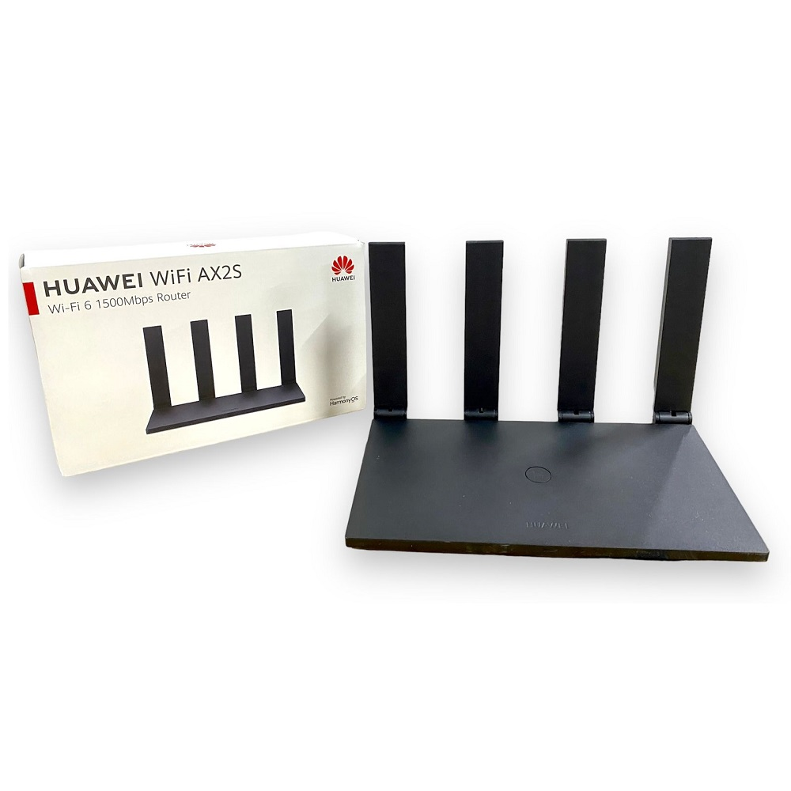

.. note:: A Topologia da rede é bem simples, aqui temos um Roteador da Huawei WiFi AX2S que será o nosso equipamento concentrador. Todas as máquinas (smartphones, desktops, notebooks ou printers) serão conectados diretamente no Roteador da Huawei. Mas o responsável pelo Gateway da Rede ou Saída para Internet, será o Modem Sagemcom Modelo F@ST3895 Claro. Todas as etapas a seguir, serão orientadas pela premissa de que já existe um modem F@ST3895 configurado e com WiFi/SSID ativo na rede doméstica do usuário. O objetivo aqui é capar as funcionalidades triviais do cable modem da Claro, desabilitar seus serviços nativos tais como o LAN DHCP, Sinal WiFi e Conexão WAN DHCP. Todos esses serviços mencionados, serão ativados agora no equipamento da Huawei. No jargão de redes é como dizer que o Modem está roteado (configurado em Modo Bridge).

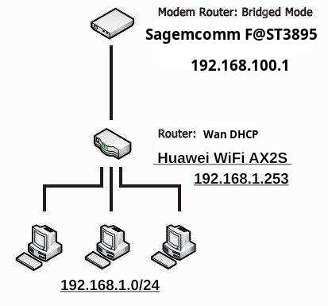
    
**Para saber mais sobre as especificações do Router** (HUAWEI WiFi AX2S) - `Entre no site oficial do fabricante. <https://consumer.huawei.com/br/routers/ax2s/>`_     
    
Configuração do Modem Sagemcom F@ST3895 em modo Bridge
^^^^^^^^^^^^^^^^^^^^^^^^^^^^^^^^^^^^^^^^^^^^^^^^^^^^^^

**Segue o manual completo em pdf do Modem Sagemcom F@ST3895** (Site da Claro) - `Entre no site oficial. <https://www.claro.com.br/files/104379/x/77b4815344/manual-do-usuario_fast_3895.pdf>`_

Antes de mais nada, faça um backup das configurações do modem e em seguida salve em uma pasta no seu computador. 

1. Navegue até a interface web do Sagemcom F@ST3895.
2. No Menu a esqueda vá em Administração e Clique em Backup. 
3. No fim da página Clique no botão Backup.
4. O F@ST3895 solicita que você salve seu arquivo de backup. Não altere a extensão do arquivo.
5. Salve seu arquivo em um local de sua escolha.

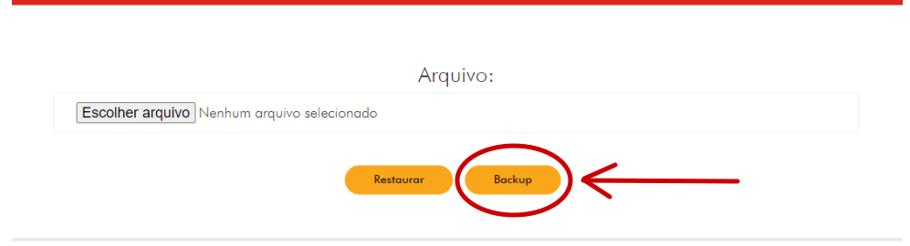

.. note:: Nunca edite os arquivos de backup, pois isso pode resultar em arquivos corrompidos, tornando-os inúteis como backup de configuração. Uma vez feito o backup, você sempre poderá retornar à configuração de trabalho mais recente do seu Sagemcom F@ST3895 em caso de problemas.

Agora vamos precisar de um cabo de rede para realizar as configurações no modem. Não dá para fazer isso pelo WiFi. Portanto conecte o cabo de rede na **porta 2** do modem Sagemcom F@ST3895 e a outra ponta do cabo vai para o seu notebook/desktop.

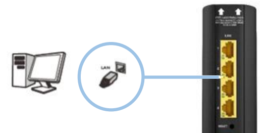

Na barra de endereços do navegador digite o IP padrão de fábrica **http://192.168.0.1** e pressione enter.
**Atenção** - Se a página não abrir, então será necessário resetar o modem e voltar as configurações de fábrica. Com uma ponta de arame de clip de papel, aperte e mantenha pressionado o botão de reset que fica localizado atrás do aparelho, e libere o botão somente depois que os leds se apagarem.

Na tela de login, insira o nome e senha que estão localizados na etiqueta do F@ST3895.

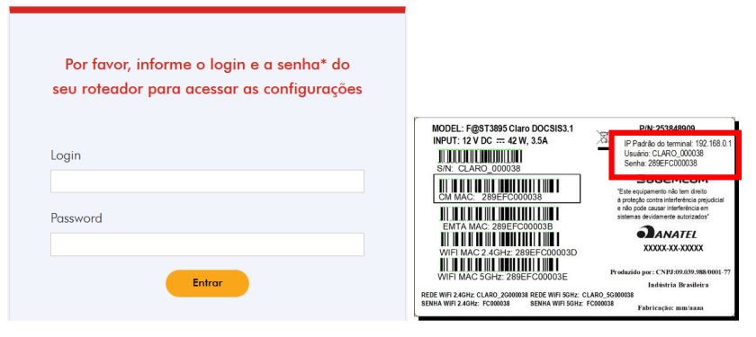

Na tela inicial do F@ST3895, no menu que fica na lateral esquerda Clique em **Redes** e depois vá em **LAN/DHCP**, aqui Desmarque a opção **Habibilitar Servidor DHCP**, logo em seguida finalize com o botão **Aplicar Ajustes**. Deixe desabilitado o serviço de DHCP, isso irá economizar recursos do aparelho.

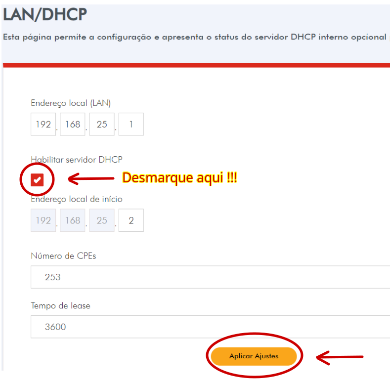

Ainda no Menu Redes faça o mesmo para o **DHCPv6** e deixe tudo desativado.

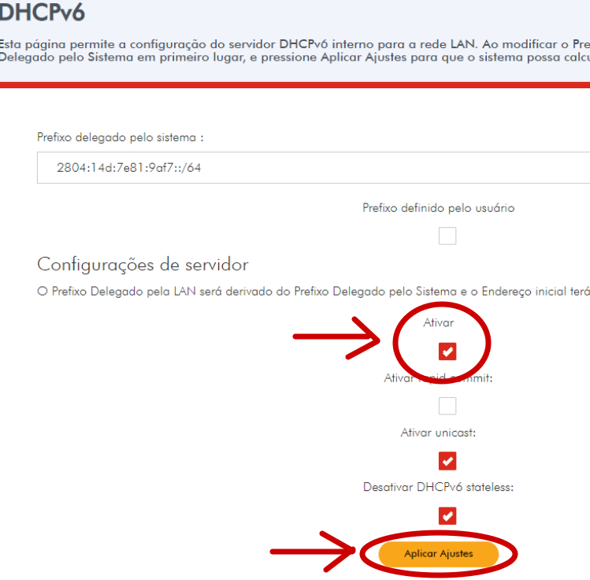

Entre no Menu Wi-fi e depois vá para Rádio, e deixe desabilitado o rádio Wifi 2.4GHZ e 5GHZ. Não esqueça de desativar também a função de WPS. Para firmar e concluir a configuração, sempre finalize no botão **Aplicar Ajustes**. 

.. figure:: Sagemcom-Radio-Off.png
    :scale: 60 %
    :align: center
    :alt: Sagemcom Radio Off

Volte para tela no Menu Redes, e finalmente vá para **Configurações Básicas**, Role a página para baixo em **Tipo de Conexão WAN** e depois Clique no símbolo seta e selecione **Modo Bridge**. Finalize em **Aplicar Ajustes**.

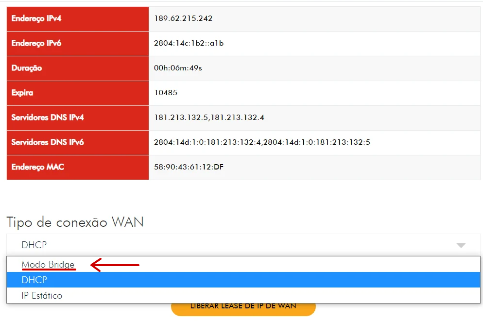

.. note:: o IP de Gerência usado para acessar as configurações foi alterado para 192.168.100.1. Agora é necessário configurar o IP da placa de rede nas configurações do seu computador, sempre que quiser acessar o modem F@ST3895.  
    
A **tela no topo da página** deverá ficar assim: 
    
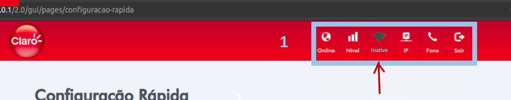

Veja abaixo como devem ficar os **status dos leds** no modem F@ST3895.

Antes da Configuração:

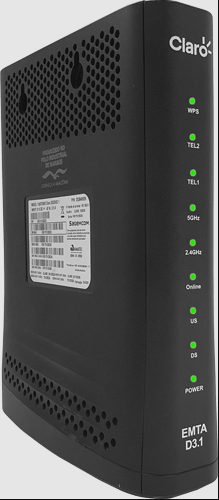

Depois da Configuração: 

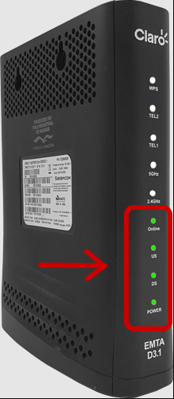

Os Leds que devem ficar acesos são: Power, DS (Downstream), US (Upstream) e Online.

=======================================================================

Configuração Router Huawei WiFi-AX2S
^^^^^^^^^^^^^^^^^^^^^^^^^^^^^^^^^^^^

Finalmente chegamos meus caros, na parte mais crucial da configuração! 😛 yeah! Bora configurar o Roteador Huawei WiFi AX2S!

Primeiro ligue o Huawei WiFi AX2S. Vamos utilizar o velho acesso via web, com uso do próprio navegador no endereço padrão de fábrica **http://192.168.2.1**. Para isso funcionar, você deve conectar o cabo de rede em qualquer uma das portas Lan. Poderá ser usada as portas 2,3 ou 4, e a outra ponta do cabo vai direto para seu computador/notebook. 

Na sequência vamos providenciar também a ligação entre o Roteador e o Modem. Conecte outro cabo de rede na **porta 1** (WAN) do Huawei WiFi AX2S, e a outra ponta do cabo vai para a **porta 4** do modem Sagemcom F@ST3895.

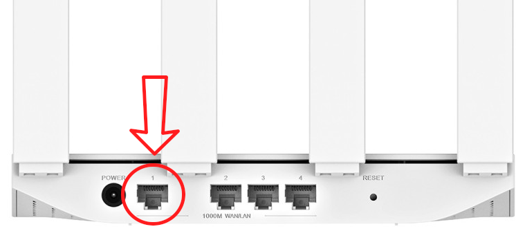

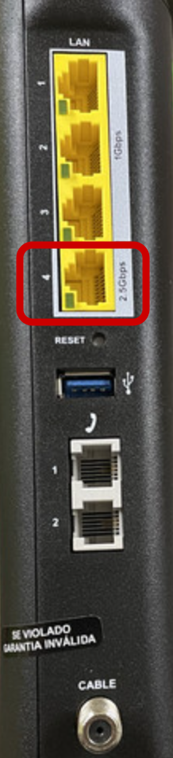

.. note:: As demais portas do modem Sagemcom F@ST3895 permanecerão em desuso. Enquanto ela estiver funcionando em modo Bridge, procure manter as portas 1, 2, e 3 sempre livres. Essas portas deverão ser usadas só para fins de manutenção local ou na necessidade de gerencia do modem.

Na tela inicial do Huawei WiFi AX2S, entre em **Mais Funções**, vá para o Menu a esquerda na seção **Configurações de Rede** e em Endereço IP da LAN altere o IP para **192.168.1.253**. Na Máscara da sub-rede insira **255.255.255.0**. 	

.. figure:: WiFi-AX2S-DHCP-01.png
    :scale: 60 %
    :align: center
    :alt: WiFi AX2S IP de Gerencia

Na opção **Servidor DHCP** deverá deixá-lo ativado, agora entre com os seguintes dados em Int. atribuição end. IP:: **192.168.1.60 - 192.168.1.100** e Tempo de concessão será de **1 Dia**.	

Em Servidor DNS Preferencial entre com: **208.67.222.222** e em DNS Alternativo entre com: **208.67.220.220**.
Para finalizar clique no botão Salvar. Será necessário apertar tecla F5 para reload da página web, e depois logar novamente no Huawei WiFi AX2S. Porém agora pelo novo endereço IP **https://192.168.1.253**.

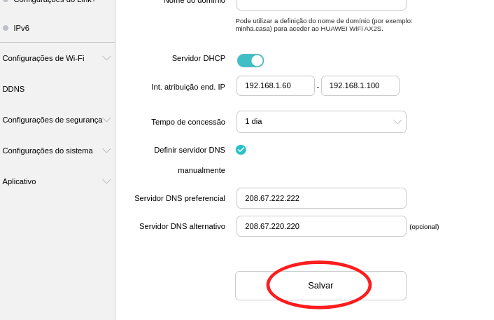

Volte para a tela principal e vá para **Meu WiFi** e insira um nome SSID para sua rede WiFi, aqui eu usei **Aliens-5G** porém você pode usar outra que quiser. As demais configurações WiFi serão deixadas no padrão de fábrica, permanecerá na melhor performance.

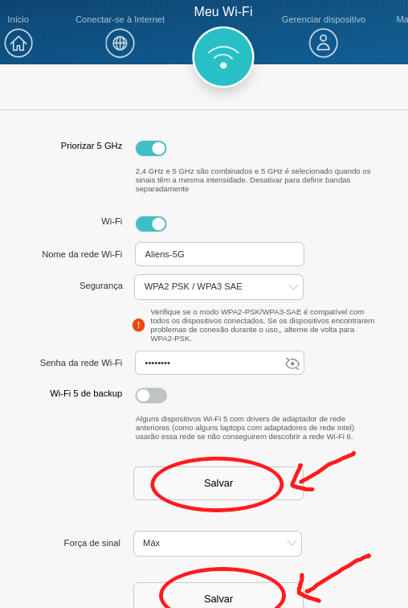
    
Após salvar as alterações, volte para tela principal do Huawei WiFi AX2S, e depois vá para o ícone do globo (Conectar-se à Internet). 

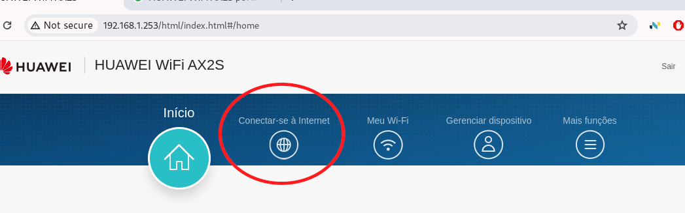
    
Na seção **Modo de Acesso à Internet**, selecione a opção **DHCP** (Dynamic Host Configuration Protocol is a common connection method used for TV Cable Modem.) 
Depois insira as informações de acesso, conforme os dados abaixo::

   MTU:			1500
   Clone de MAc:	Nenhum Clone de Mac
   
   Servidor DNS preferencial:  208.67.222.222 
   Servidor DNS alternativo:   208.67.220.220

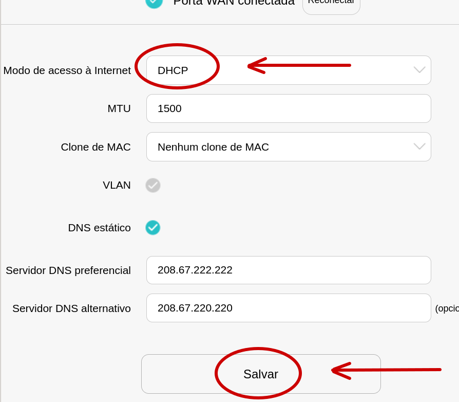

Finalize em botão **SALVAR**.

Vá para o topo da página e clique no botão **Reconectar**, para realizar a autenticação. 
    
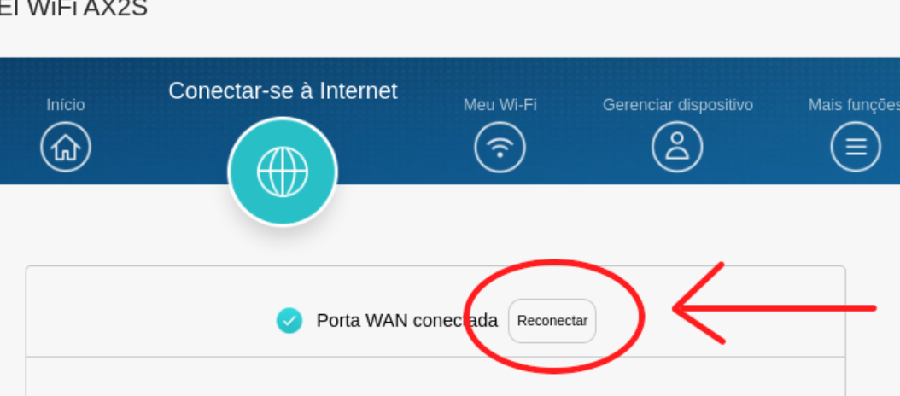

Se tudo estiver certo, será estabelecido a conexão WAN de Internet Banda Larga.

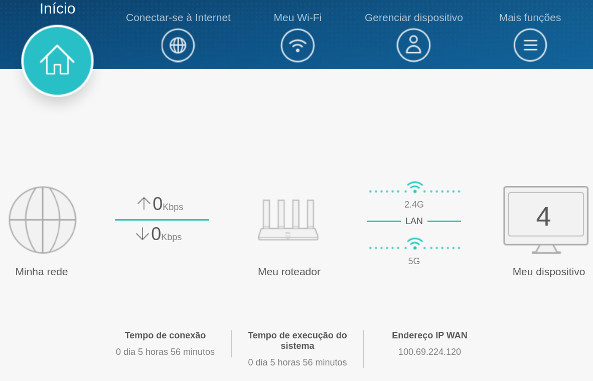

.. note:: O endereço de IP de Wan 100.69.224.120 é uma rede privada dentro do provedor ISP, mas entenda que o bloco de IP publico é outro. Por exemplo para a mim aqui é a Operadora Claro, ela usa a rede 179.209.44.0 classe B, região São Paulo - SP, Brazil - conexão DSL Banda Larga/Cabo/Fibra.

=======================================================================

Uhhhhuuuuuuuuu!  😛 Meus parabéns ^^  agora vc pode usufruir do padrão de transmissão: **802.11ax**/ac/a/n 2 × 2 e 802.11b/g/n 2 × 2, MU-MIMO, OFDMA, ATF.
Com uma taxa de transmissão sem fio de até 1500 Mbps, banda de 5 GHz que suporta Wi-Fi 6 e taxa de transmissão máxima de 1201 Mbps, jogos, streaming e downloads nunca funcionaram tão bem. Para ficar melhor ainda pessoal, quem puder já podem adquirir o Huawei Wifi Be3 (3.6 Gpbs Dual-Band Wi-Fi 7) pelo site oficial:: `www.huawei.com <https://consumer.huawei.com/br/routers/wifi-be3/>`_, melhoria contínua sempre, vamo que vamo 😛!
