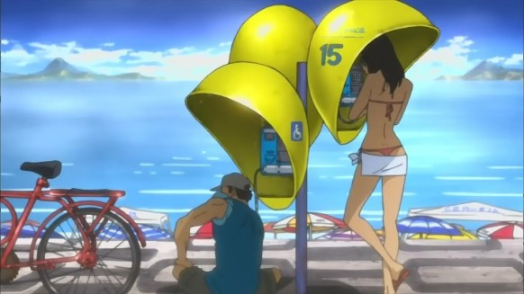
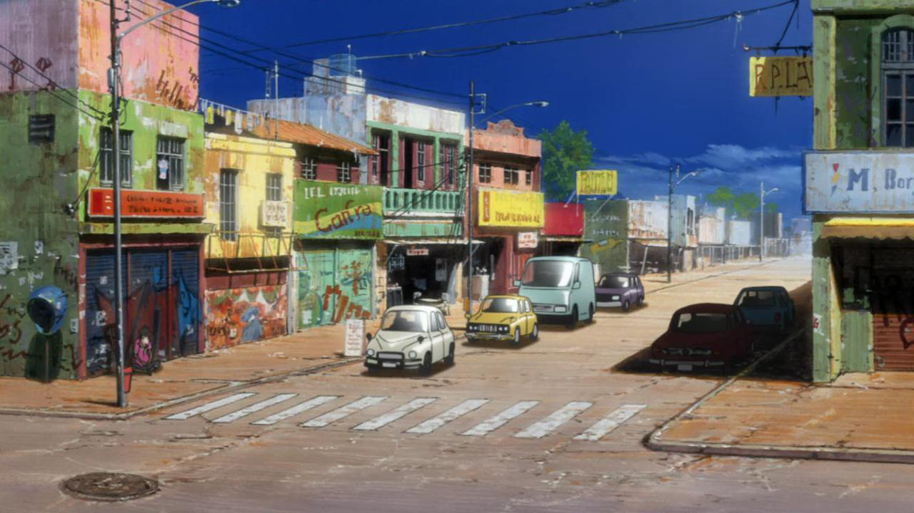

Paradoxo do Nosso Tempo
-----------------------

Nós bebemos demais, fumamos demais,
gastamos sem critérios, dirigimos rápido demais,
ficamos acordados até muito mais tarde,
acordamos muito cansados,
lemos pouco, assistimos TV demais
e rezamos raramente.

Multiplicamos nossos bens, mas reduzimos nossos valores.
Nós falamos demais, amamos raramente, odiamos frequentemente.  
Aprendemos a sobreviver, mas não a viver.
Adicionamos anos à nossa vida e não vida aos nossos anos.

Fomos e voltamos à Lua, mas temos dificuldade em cruzar a rua
e encontrar um novo vizinho.
Conquistamos o espaço, mas não nosso próprio.
Fizemos muitas coisas maiores, mas pouquíssimas melhores.  

Limpamos o ar, mas poluímos a alma;
dominamos o átomo, mas não nosso preconceito;
escrevemos mais, mas aprendemos menos;
planejamos mais, mas realizamos menos.
Aprendemos a nos apressar e não, a esperar.

Construímos mais computadores para armazenar mais informação,
produzir mais cópias do que nunca, mas nos comunicamos menos.
Estamos na era do 'fast-food' e da digestão lenta;
do homem grande de caráter pequeno;
excesso de reuniões e relações vazias.
Essa é a era de dois empregos,
vários divórcios, casas chiques e lares despedaçados.
Essa é a era das viagens rápidas, fraldas e moral descartáveis,
das rapidinhas, dos cérebros ocos e das pílulas 'mágicas'.  

Um momento de muita coisa na vitrine e muito pouco na dispensa.
Uma era que leva essa carta a você,
e uma era que te permite dividir essa reflexão ou simplesmente clicar 'delete'.  

Lembre-se de passar tempo com as pessoas que ama,
pois elas não estarão por aqui para sempre.
Lembre-se dar um abraço carinhoso num amigo,
pois não lhe custa um centavo sequer.
Lembre-se de dizer **'eu te amo'** à sua companheira(o)
e às pessoas que ama.
Um beijo e um abraço curam a dor, quando vêm de lá de dentro.

O segredo da vida não é ter tudo que você quer,
mas amar tudo que você tem!!!
Por isso, valorize o que você tem e as pessoas que estão ao seu lado.

    

