Dúvidas mais frequentes de Office 365
======================================
Copyright © 2019 Microsoft, Inc. All Rights Reserved.

.. note:: Lista de dúvidas frequentes elaborados por Tyuatsu.

.. _Siga os passos abaixo:

1. Como usar o Outlook do Office 365?
^^^^^^^^^^^^^^^^^^^^^^^^^^^^^^^^^^^^^

1.1. Após efetuar login no portal ( `https://portal.office.com <https://portal.office.com/>`_), clique em Outlook na parte superior da tela:
"""""""""""""""""""""""""""""""""""""""""""""""""""""""""""""""""""""""""""""""""""""""""""""""""""""""""""""""""""""""""""""""""""""""""""""
.. figure:: outlook.png
    :scale: 100 %
    :align: center
    :alt: outlook

1.2. Clique em Novo email para escrever uma nova mensagem:
""""""""""""""""""""""""""""""""""""""""""""""""""""""""""
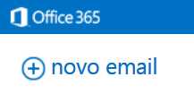

1.3. Preencha os campos e clique em enviar:
"""""""""""""""""""""""""""""""""""""""""""
.. figure:: outlook2.png
    :scale: 100 %
    :align: center
    :alt: outlook2

1.4. Veja outras opções que podem ser exibidas na hora do envio da mensagem:
""""""""""""""""""""""""""""""""""""""""""""""""""""""""""""""""""""""""""""
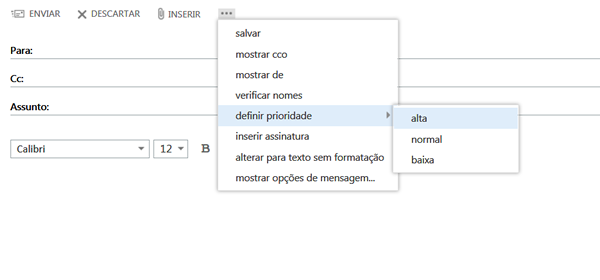
    
**OBS:** Os e-mails são recebidos automaticamente, sem a necessidade de forçar o envio ou recebimento.    
""""""""""""""""""""""""""""""""""""""""""""""""""""""""""""""""""""""""""""""""""""""""""""""""""""""

2. Como baixar os programas do Office 365 para meu computador?
^^^^^^^^^^^^^^^^^^^^^^^^^^^^^^^^^^^^^^^^^^^^^^^^^^^^^^^^^^^^^^

2.1. Após efetuar login no portal, clique em Configuração do Office 365:
""""""""""""""""""""""""""""""""""""""""""""""""""""""""""""""""""""""""
.. figure:: instalacao.png
    :scale: 100 %
    :align: center
    :alt: instalacao
    
2.2. Clique em Software:
"""""""""""""""""""""""" 
.. figure:: instalacao1.png
    :scale: 100 %
    :align: center
    :alt: instalacao1

2.3. Selecione o idioma e a versão da aplicação e clique em instalar.
"""""""""""""""""""""""""""""""""""""""""""""""""""""""""""""""""""""
Por padrão o Office é instalado em 32 bits para evitar incompatibilidade com outros softwares, independente da versão do S.O.:

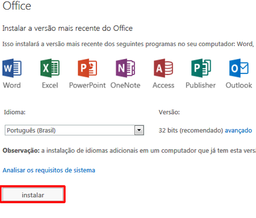

2.4. Clique em executar:
""""""""""""""""""""""""
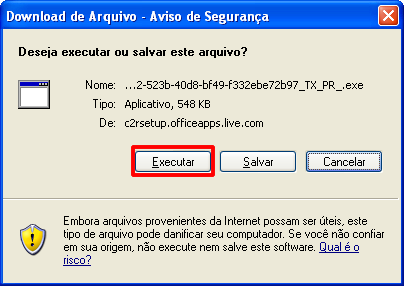

2.5. Aguarde o fim do download:
"""""""""""""""""""""""""""""""
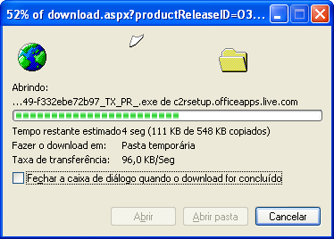
    
2.6. Aguarde a preparação:
""""""""""""""""""""""""""
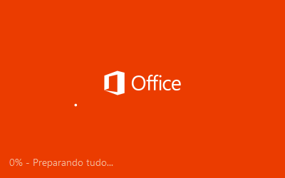

2.7. Espere, pois o Office esta baixando algumas configurações:
"""""""""""""""""""""""""""""""""""""""""""""""""""""""""""""""
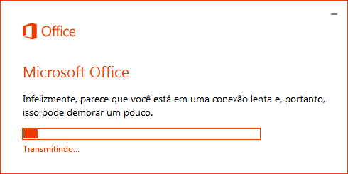

2.8. Veja a tela de boas vindas e clique em Avançar:
""""""""""""""""""""""""""""""""""""""""""""""""""""
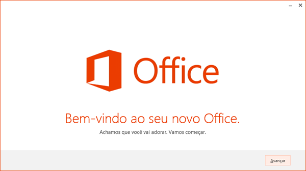

2.9. Assita ao vídeo de apresentação:
"""""""""""""""""""""""""""""""""""""
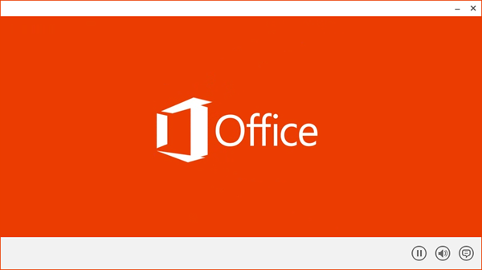
    
2.10. Caso seja necessário, clique em Saiba mais para ser direcionado ao link de mais informações sobre o SkyDrive ou apenas clique em Avançar:
"""""""""""""""""""""""""""""""""""""""""""""""""""""""""""""""""""""""""""""""""""""""""""""""""""""""""""""""""""""""""""""""""""""""""""""""
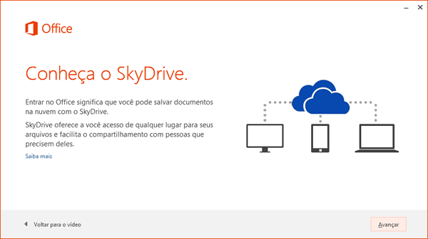

2.11. Escolha o layout do seu Office e clique em avançar:
"""""""""""""""""""""""""""""""""""""""""""""""""""""""""
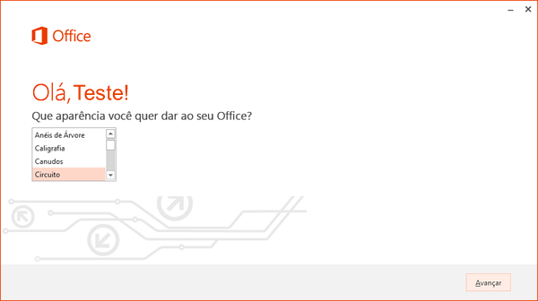

2.12. Caso seja desejado, clique em Dê uma olhada para saber todas as novidades do Office, ou para continuar a instalação, clique em não obrigado:
""""""""""""""""""""""""""""""""""""""""""""""""""""""""""""""""""""""""""""""""""""""""""""""""""""""""""""""""""""""""""""""""""""""""""""""""""
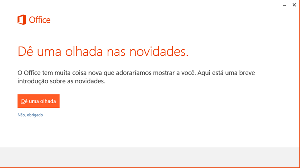

2.13. Clique em Tudo Pronto! Para sair usando seu Office:
"""""""""""""""""""""""""""""""""""""""""""""""""""""""""
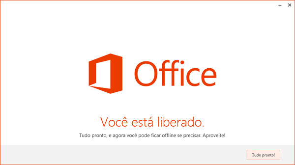

3. Primeiros passos de configuração do serviço Software do Office 365
^^^^^^^^^^^^^^^^^^^^^^^^^^^^^^^^^^^^^^^^^^^^^^^^^^^^^^^^^^^^^^^^^^^^^

3.1. Após efetuar login no portal, clique em Software:
""""""""""""""""""""""""""""""""""""""""""""""""""""""
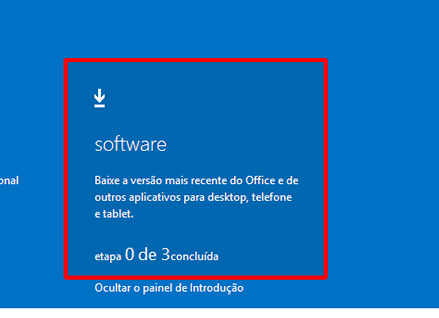
    
    
3.2. Leia as informações básicas do que é possível fazer com os softwares instalados e após, clique em iniciar agora:
"""""""""""""""""""""""""""""""""""""""""""""""""""""""""""""""""""""""""""""""""""""""""""""""""""""""""""""""""""""
.. figure:: software1.png
    :scale: 100 %
    :align: center
    :alt: software1
    
3.3. Vamos começar pelo passo 1, configure seu software:
""""""""""""""""""""""""""""""""""""""""""""""""""""""""
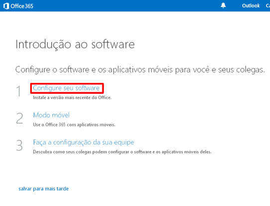
    
3.4. Por padrão, o Office é instalado na versão 32 bits para não gerar incompatibilidade com outros softwares, independentemente da versão do S.O.
""""""""""""""""""""""""""""""""""""""""""""""""""""""""""""""""""""""""""""""""""""""""""""""""""""""""""""""""""""""""""""""""""""""""""""""""""
 Selecione o idioma, a versão e clique em **Instalar**; Para dar continuidade no tutorial, clique em **concluir**:

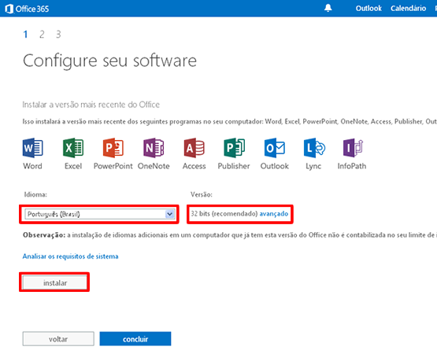
    
3.5. Será finalizado o primeiro passo. Agora clique em modo móvel:
""""""""""""""""""""""""""""""""""""""""""""""""""""""""""""""""""
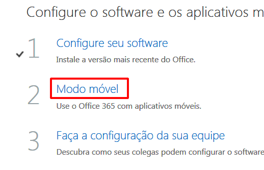
    
3.6. Selecione o modelo do S.O. do seu dispositivo móvel para ser levado até a página de ajuda para configuração. No tutorial, clique em concluir.
""""""""""""""""""""""""""""""""""""""""""""""""""""""""""""""""""""""""""""""""""""""""""""""""""""""""""""""""""""""""""""""""""""""""""""""""""
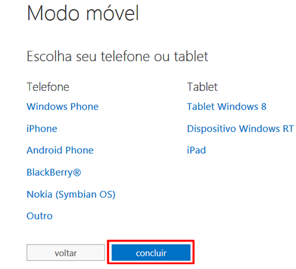
    
3.7. Seus próprios colegas configuram o software e os aplicativos móveis depois que iniciam a sessão.
"""""""""""""""""""""""""""""""""""""""""""""""""""""""""""""""""""""""""""""""""""""""""""""""""""""
Quando iniciam a sessão do Office 365 pela primeira vez, eles recebem informações sobre o Office 365 e aprendem a instalar o software e configurar os dispositivos móveis deles. 

**Observação:** se você ainda não adicionou usuários nem designou licenças, vá para a página Usuários & grupos. Eles também podem instalar o software e configurar os dispositivos móveis deles posteriormente na página **Software**. Clique em concluir para finalizar o tutorial:

.. figure:: software6.png
    :scale: 100 %
    :align: center
    :alt: software6
    
3.8. - Para finalizar, basta clicar em **Tudo pronto**.
"""""""""""""""""""""""""""""""""""""""""""""""""""""""

4. Como editar ou remover um usuário no Office 365?
^^^^^^^^^^^^^^^^^^^^^^^^^^^^^^^^^^^^^^^^^^^^^^^^^^^

4.1. Veja a figura abaixo:
""""""""""""""""""""""""""
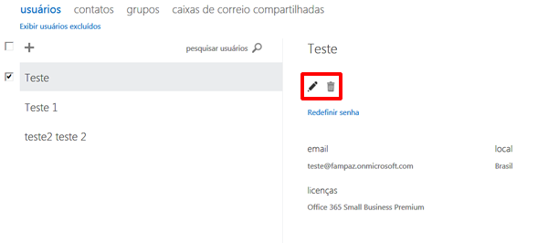

Na tela gerenciadora de usuários, para editar um usuário, basta seleciona-lo e clicar no lápis localizado à direita. Para remover, basta clicar na lixeira posicionada ao lado do lápis (ao clicar, o sistema pergunta se você deseja realmente excluir aquele usuário). Ao excluir um usuário, seus dados são excluídos e as licenças de usuário podem ser reatribuídas.

.. note:: Você pode restaurar um usuário que foi excluído, mas as contas do usuário excluído não poderão ser recuperadas após 30 dias.
    
5. Como visualizar o número de licenças usadas e disponíveis no Office 365?
^^^^^^^^^^^^^^^^^^^^^^^^^^^^^^^^^^^^^^^^^^^^^^^^^^^^^^^^^^^^^^^^^^^^^^^^^^^

5.1. Veja a figura abaixo:
""""""""""""""""""""""""""
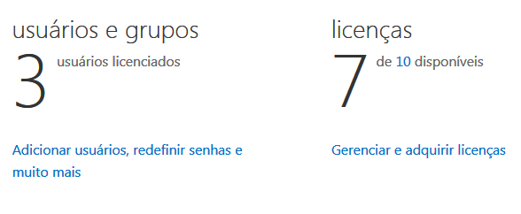
    
Para visualizar o número de licenças disponíveis, basta logar com a conta ADM e estar com o Painel de Introdução oculto e verificar a informação.  

6. Como acessar o Painel de Controle do Office 365?
^^^^^^^^^^^^^^^^^^^^^^^^^^^^^^^^^^^^^^^^^^^^^^^^^^^

6.1. Para utilizar o Office 365 pela primeira vez siga os passos abaixo:
""""""""""""""""""""""""""""""""""""""""""""""""""""""""""""""""""""""""

6.1.1. Entre no portal Office 365 no endereço `https://portal.office.com <https://portal.office.com/>`_
"""""""""""""""""""""""""""""""""""""""""""""""""""""""""""""""""""""""""""""""""""""""""""""""""""""""""
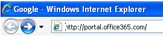

6.1.2. Faça login com o usuário e senha encaminhados por e-mail, após clique em Entrar:
"""""""""""""""""""""""""""""""""""""""""""""""""""""""""""""""""""""""""""""""""""""""""
.. figure:: login-office-02.png
    :scale: 100 %
    :align: center
    :alt: login-office-02

6.1.3. Esta será a sua página principal, de onde poderá gerenciar sua conta:
""""""""""""""""""""""""""""""""""""""""""""""""""""""""""""""""""""""""""""""
.. figure:: login-office-03.png
    :scale: 100 %
    :align: center
    :alt: login-office-03

7. Como usar o calendário do Office 365?
^^^^^^^^^^^^^^^^^^^^^^^^^^^^^^^^^^^^^^^^

7.1. Para acessar o Calendário, clique em Calendário na parte superior da tela:
""""""""""""""""""""""""""""""""""""""""""""""""""""""""""""""""""""""""""""""""
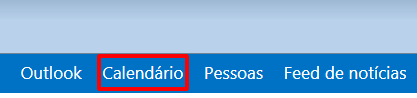

7.2. Para adicionar um novo evento, clique em Novo Evento:
""""""""""""""""""""""""""""""""""""""""""""""""""""""""""
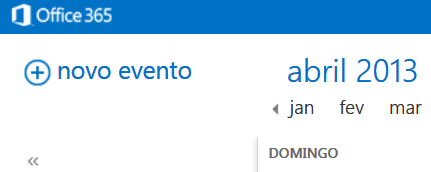

7.3. Preencha os campos e caso seja uma reunião online, clique sobre Reunião Online para enviar um link de participação na Reunião. 
"""""""""""""""""""""""""""""""""""""""""""""""""""""""""""""""""""""""""""""""""""""""""""""""""""""""""""""""""""""""""""""""""""
Feito isso, basta clicar em salvar no canto superior direito da tela:

.. figure:: calendario2.png
    :scale: 100 %
    :align: center
    :alt: calendario2

7.4. Essas são as informações da Reunião:
"""""""""""""""""""""""""""""""""""""""""
.. figure:: calendario3.png
    :scale: 100 %
    :align: center
    :alt: calendario3

7.5. No canto superior direito, temos o modo de visualização (DIA, SEMANA ÚTIL, SEMANA, MÊS)
""""""""""""""""""""""""""""""""""""""""""""""""""""""""""""""""""""""""""""""""""""""""""""
E abaixo temos a opção de compartilhar com outra pessoa o seu calendário:

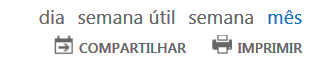

7.6. - Basta preencher os campos e enviar:
""""""""""""""""""""""""""""""""""""""""""
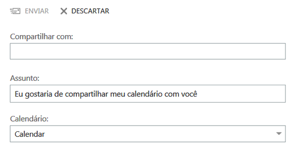

8. Entendendo o Painel Administrativo do Office 365
^^^^^^^^^^^^^^^^^^^^^^^^^^^^^^^^^^^^^^^^^^^^^^^^^^^

8.1. Após logar, o Painel Administrativo é apresentado desta forma:
"""""""""""""""""""""""""""""""""""""""""""""""""""""""""""""""""""
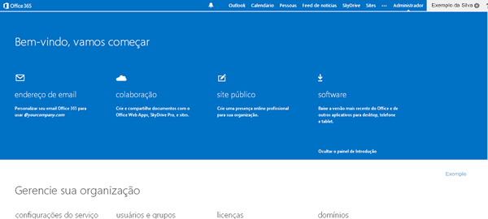

8.2. Vamos ver com mais detalhes:
"""""""""""""""""""""""""""""""""
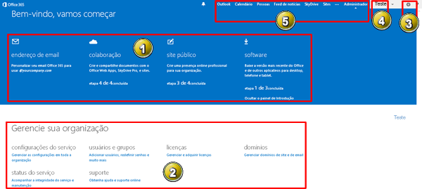

* [1] Painel de Instrução: local onde apresenta passo-a-passo das tarefas que a ferramenta disponibiliza;

* [2] Painel Administrativo, onde podemos alterar as configurações, verificar o status do serviço, gerenciar a assinatura, gerenciar usuários, domínios e demais tipos de configurações;

* [3] Ícone de configurações, onde podemos acessar os programas, acessar a área de instalação, informações pessoais, alteração do idioma do portal e acessar as informações de introdução novamente;

* [4] Menu onde podemos alterar as configurações pessoais, como comentários, notícias que acompanho, alterar seu blog pessoal, adicionar aplicativos e adicionar tarefas;

* [5] Local utilizado para acessar as ferramentas de e-mail (Outlook), Calendário, Contatos (Pessoas), Notícias, Skydrive e Sites.

9. Primeiros passos de configuração do serviço Colaboração do Office 365
^^^^^^^^^^^^^^^^^^^^^^^^^^^^^^^^^^^^^^^^^^^^^^^^^^^^^^^^^^^^^^^^^^^^^^^^

9.1. Após efetuar login no portal, clique em Colaboração:
"""""""""""""""""""""""""""""""""""""""""""""""""""""""""
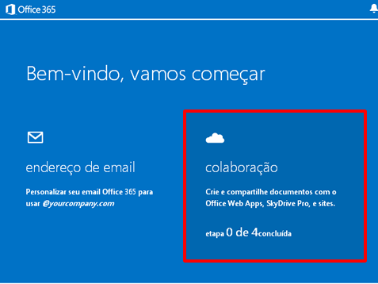

9.2. Neste tutorial, o Office lhe passará noções básicas sobre o skydrive Pro, Sites de equipe e Newsfeeds. Clique em Iniciar agora:
""""""""""""""""""""""""""""""""""""""""""""""""""""""""""""""""""""""""""""""""""""""""""""""""""""""""""""""""""""""""""""""""""""
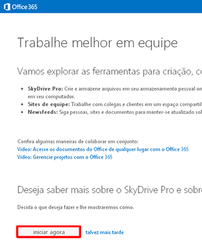

9.3. Vamos começar pelo passo 1: clique em Confira o SkyDrive Pro e os sites de equipe:
"""""""""""""""""""""""""""""""""""""""""""""""""""""""""""""""""""""""""""""""""""""""
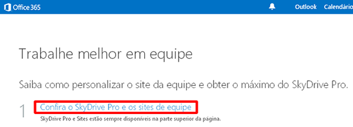

9.4. Veja onde localizar a ferramenta para carregar documentos pessoais e clique em próximo:
"""""""""""""""""""""""""""""""""""""""""""""""""""""""""""""""""""""""""""""""""""""""""""""
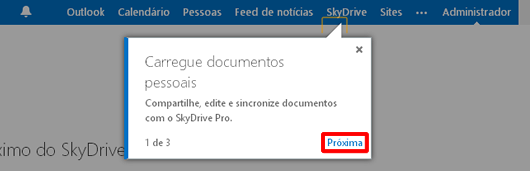

9.5. Localize a ferramenta para sites públicos e de equipe e clique em próximo:
"""""""""""""""""""""""""""""""""""""""""""""""""""""""""""""""""""""""""""""""
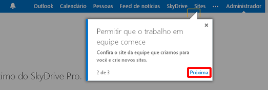

9.6. Visualize o local para acompanhar o andamento das atividades e clique em concluir:
"""""""""""""""""""""""""""""""""""""""""""""""""""""""""""""""""""""""""""""""""""""""
.. figure:: colaboracao7.png
    :scale: 100 %
    :align: center
    :alt: colaboracao7

9.7. Após concluir, verifique que o passo 1 foi finalizado:
"""""""""""""""""""""""""""""""""""""""""""""""""""""""""""
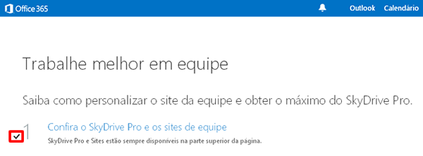

9.8. Vamos iniciar o passo 2, clique em Conheça o SkyDrive Pro:
"""""""""""""""""""""""""""""""""""""""""""""""""""""""""""""""
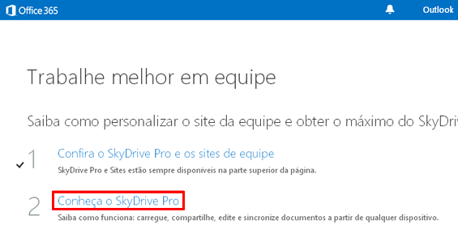

9.7. Nesta tela, o tutorial mostra alguma atividades que o SkyDrive Pro pode realizar
"""""""""""""""""""""""""""""""""""""""""""""""""""""""""""""""""""""""""""""""""""""
Como carregar um documento, editar um documento, compartilhe com outras pessoas e sincronizar com seu computador. Verifique e clique em continuar:

.. figure:: colaboracao10.png
    :scale: 100 %
    :align: center
    :alt: colaboracao10

9.8. Veja os passos para carregar um documento 
""""""""""""""""""""""""""""""""""""""""""""""
Clique em SkyDrive, localize o arquivo no seu computador. Arraste o arquivo pelo espaço de Documentos e solte-o em SkyDrive Pro. Após, clique em continuar para dar seguimento no tutorial:

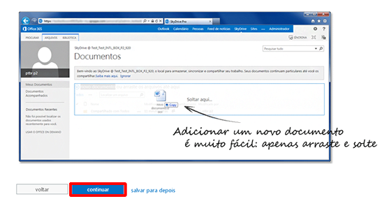

9.9. Esta tela mostra como editar um documento
""""""""""""""""""""""""""""""""""""""""""""""
Clique no nome do documento. Clique em Editar documento > Editar no aplicativo Word Web. Clique em Salvar quando terminar. Vá em continuar:

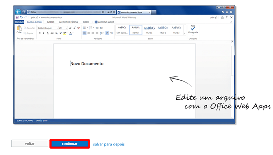

9.10. Confira as informações para compartilhar seu documento
""""""""""""""""""""""""""""""""""""""""""""""""""""""""""""
Clique em no documento que você deseja compartilhar e clique em Convidar pessoas. Insira os endereços de email ou nomes de pessoas com as quais você deseja compartilhar. Se você desejar, adicione uma mensagem e clique em Compartilhar. Após, clique em continuar para dar continuidade:

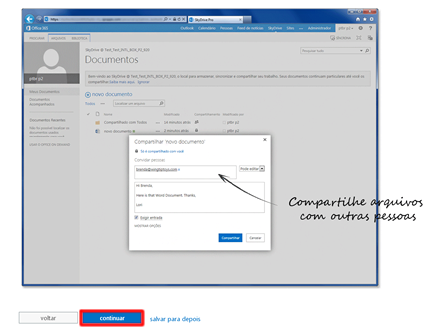

9.11. Veja os passos para sincronizar os arquivos com seu computador
""""""""""""""""""""""""""""""""""""""""""""""""""""""""""""""""""""
 No SkyDrive Pro, na parte superior da página, clique em Sincronizar e clique em Sincronizar agora. Clique em Mostrar meus arquivos para iniciar o gerenciamento de documentos do seu computador. Após ler a explicação, clique em continuar:

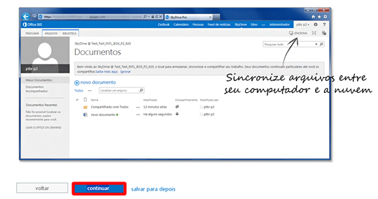

9.12. Chegamos ao final da segunda parte do tutorial, basta clicar em concluir:
"""""""""""""""""""""""""""""""""""""""""""""""""""""""""""""""""""""""""""""""    
.. figure:: colaboracao15.png
    :scale: 100 %
    :align: center
    :alt: colaboracao15

9.13. Verifique que agora temos o passo 1 e o passo 2 concluídos:
"""""""""""""""""""""""""""""""""""""""""""""""""""""""""""""""""
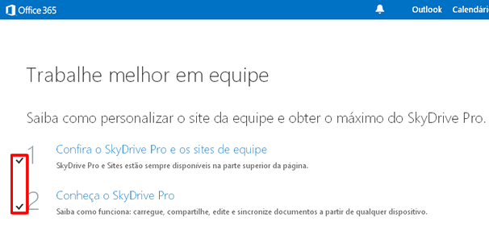

9.14. Clique em Personaliza a aparência do site da equipe, para iniciar o passo 3:
""""""""""""""""""""""""""""""""""""""""""""""""""""""""""""""""""""""""""""""""""
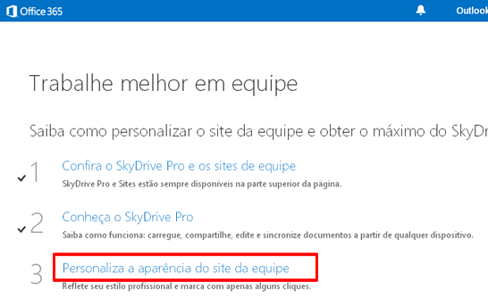

9.15. Verifique no descritivo algumas possibilidades que há na função de sites e clique em continuar:
"""""""""""""""""""""""""""""""""""""""""""""""""""""""""""""""""""""""""""""""""""""""""""""""""""""
.. figure:: colaboracao18.png
    :scale: 100 %
    :align: center
    :alt: colaboracao18

9.16. Veja como alterar o logotipo de sua empresa
"""""""""""""""""""""""""""""""""""""""""""""""""
Clique em Sites e clique em Site da equipe. Clique em Seu site. Sua marca. Carregue seu logotipo e altere o título do site. Após, clique em continuar.    

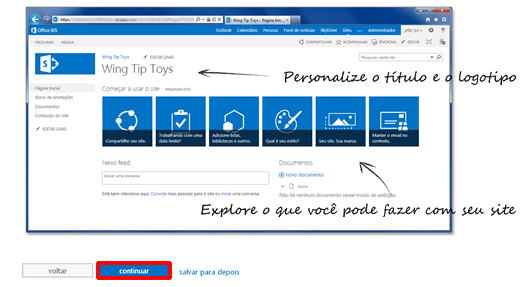

9.17. Como alterar o tema de seu site
"""""""""""""""""""""""""""""""""""""
Em seu site de equipe, clique em Qual o seu estilo? Selecione um estilo e personalize-o escolhendo sua própria imagem de fundo e esquema de cores. Clique em Experimente e se você gostar, clique em Alterar. Leia e clique em continuar:

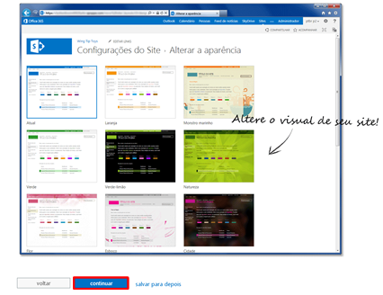

9.18. Pronto! Passo 3 finalizado, clique em concluir:
"""""""""""""""""""""""""""""""""""""""""""""""""""""
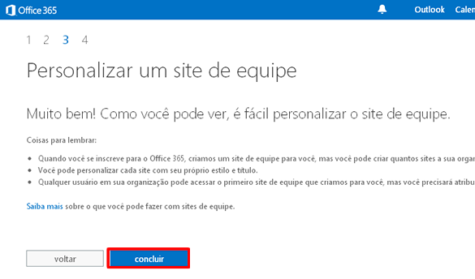

9.19. Verifique que agora temos 3 passos concluídos:
""""""""""""""""""""""""""""""""""""""""""""""""""""
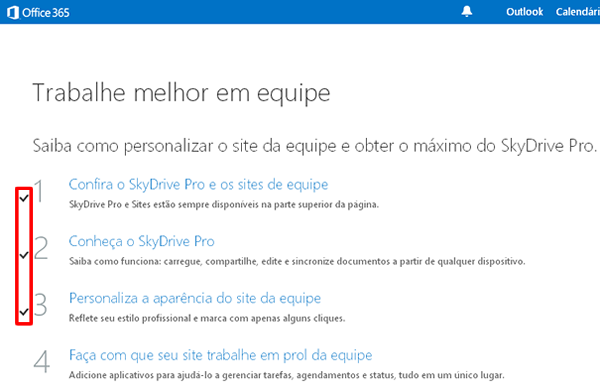

9.20. Clique em Faça com que seu site trabalhe em prol da equipe para iniciar o passo 4:
""""""""""""""""""""""""""""""""""""""""""""""""""""""""""""""""""""""""""""""""""""""""
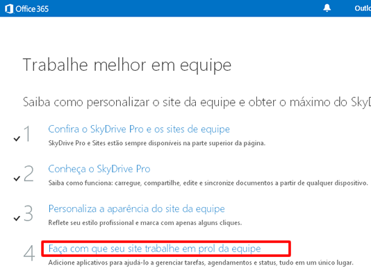

9.21. Veja algumas possibilidades que esta configuração pode lhe proporcionar e clique em continuar:
""""""""""""""""""""""""""""""""""""""""""""""""""""""""""""""""""""""""""""""""""""""""""""""""""""
.. figure:: colaboracao24.png
    :scale: 100 %
    :align: center
    :alt: colaboracao24

9.22. Veja como adicionar um cronograma de projeto
""""""""""""""""""""""""""""""""""""""""""""""""""
Clique em Sites e clique em Sites de equipe. Clique em Trabalhando com um prazo? Confirme que você deseja adicionar as tarefas e o calendário de aplicativos ao seu site. Após, clique em continuar:

.. figure:: colaboracao25.png
    :scale: 100 %
    :align: center
    :alt: colaboracao25      

9.23. Como adicionar uma lista de tarefas personalizada
"""""""""""""""""""""""""""""""""""""""""""""""""""""""
No site de equipe, clique em Adicionar listas, bibliotecas e outros aplicativos. Na página de Seus aplicativos, clique em Lista personalizada, atribua-lhe um nome e clique em Criar. Na página de Conteúdo do Site, selecione a nova lista e adicione itens. Após, clique em continuar:

.. figure:: colaboracao26.png
    :scale: 100 %
    :align: center
    :alt: colaboracao26

9.24. Pronto! Passo 4 concluído. Clique em concluir:
""""""""""""""""""""""""""""""""""""""""""""""""""""
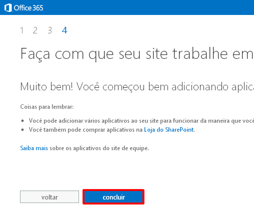

9.25. Veja que agora temos os 4 passos concluídos. Clique em tudo pronto:
"""""""""""""""""""""""""""""""""""""""""""""""""""""""""""""""""""""""""
.. figure:: colaboracao28.png
    :scale: 100 %
    :align: center
    :alt: colaboracao28

9.26. Você retornará para a tela inicial, veja que constam 4 de 4 passos concluídos para o item colaboração:
""""""""""""""""""""""""""""""""""""""""""""""""""""""""""""""""""""""""""""""""""""""""""""""""""""""""""""
.. figure:: colaboracao29.png
    :scale: 100 %
    :align: center
    :alt: colaboracao29

10. Como editar um documento já criado no serviço de Colaboração do Office 365?       
^^^^^^^^^^^^^^^^^^^^^^^^^^^^^^^^^^^^^^^^^^^^^^^^^^^^^^^^^^^^^^^^^^^^^^^^^^^^^^^

10.1. Após logar no Office 365 e clicar em Skydrive, clique sobre o documento desejado:
"""""""""""""""""""""""""""""""""""""""""""""""""""""""""""""""""""""""""""""""""""""""
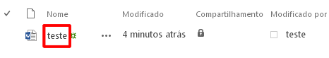

10.2. Selecione a opção: Editar no Word Web APP:    
""""""""""""""""""""""""""""""""""""""""""""""""
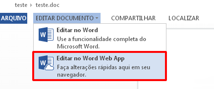

10.3. Caso a versão do arquivo seja inferior (2003 .doc) o processo fará a conversão do arquivo para o mais atual (.docx), basta clicar em converter:    
"""""""""""""""""""""""""""""""""""""""""""""""""""""""""""""""""""""""""""""""""""""""""""""""""""""""""""""""""""""""""""""""""""""""""""""""""""""
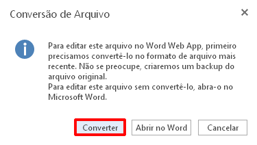

Aguarde a conversão do documento.

10.4. Agora, basta clicar em editar:
""""""""""""""""""""""""""""""""""""
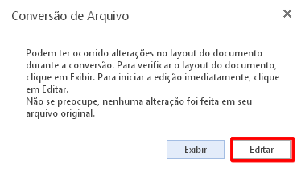

10.5. Edite o arquivo conforme desejado
"""""""""""""""""""""""""""""""""""""""
Após, clique em salvar no canto superior esquerdo e para finalizar, clique no X localizado no canto superior direito da tela:

10.6. O sistema deixa armazenado os dois arquivos
"""""""""""""""""""""""""""""""""""""""""""""""""
O anterior (.doc) e o atual (.docx), basta ver pelo tempo de criação dos arquivos:

    
11. Como criar um novo usuário no Office 365?    
^^^^^^^^^^^^^^^^^^^^^^^^^^^^^^^^^^^^^^^^^^^^^

11.1. Efetuelogin no portal com seu usuário e senha do Office 365:
""""""""""""""""""""""""""""""""""""""""""""""""""""""""""""""""""    

11.2. Em seguida clique em Adicionar usuários, redefinir senhas e muito mais:
""""""""""""""""""""""""""""""""""""""""""""""""""""""""""""""""""""""""""""""    

11.3. Na próxima página será exibido seu usuário principal já cadastrado.
"""""""""""""""""""""""""""""""""""""""""""""""""""""""""""""""""""""""""
Para cadastrar novos usuários, de acordo com a quantidade de licenças que adquiriu, clique no sinal **+** na parte superior da tela:

11.4. Insira os dados do novo usuário, conforme solicitado e clique no botão Avançar:
"""""""""""""""""""""""""""""""""""""""""""""""""""""""""""""""""""""""""""""""""""""

    
11.5 Na próxima página você irá definir o perfil do novo usuário:
""""""""""""""""""""""""""""""""""""""""""""""""""""""""""""""""""
* [a] **Atribuir Permissões**

Na primeira opção clique em **SIM**, se desejar que este novo usuário seja também administrador das licenças do Office 365. Caso não queira que este novo usuário tenha este acesso, clique em **Não**

* [b] **Definir local do Usuário**

Escolha o país de onde o usuário irá acessar a conta do Office 365 (por ex: Brasil). Após, clique em Avançar:

11.6. Escolha o produto ao qual deseja liberar o acesso para o novo usuário.
""""""""""""""""""""""""""""""""""""""""""""""""""""""""""""""""""""""""""""
Nesta página você poderá ver quantas licenças ainda estão disponíveis para serem atribuídas à novos usuários, após verificar as informações clique em Próximo:

.. figure:: usuario4.png
    :scale: 100 %
    :align: center
    :alt: usuario4  

11.7. Caso queira enviar o nome do usuário e a senha temporária ao novo usuário por e-mail
""""""""""""""""""""""""""""""""""""""""""""""""""""""""""""""""""""""""""""""""""""""""""
Preencha o campo com o endereço de e-mail desejado e clique em **Criar**:

11.8. Clique em Concluir e pronto! O novo usuário foi cadastrado.
"""""""""""""""""""""""""""""""""""""""""""""""""""""""""""""""""
Caso possua mais licenças do Office para cadastrar, siga os passos novamente.    

12. Como sincronizar um documento no serviço Colaboração do Office 365?
^^^^^^^^^^^^^^^^^^^^^^^^^^^^^^^^^^^^^^^^^^^^^^^^^^^^^^^^^^^^^^^^^^^^^^^

12.1. Na parte superior da tela, clique em Síncrona:
""""""""""""""""""""""""""""""""""""""""""""""""""""

12.2. Após, clique em permitir:
"""""""""""""""""""""""""""""""
.. figure:: sincronia2.png
    :scale: 100 %
    :align: center
    :alt: sincronia2
    
12.3. Agora você pode clicar em exibir meus documentos para ver os arquivos serem sincronizados:
""""""""""""""""""""""""""""""""""""""""""""""""""""""""""""""""""""""""""""""""""""""""""""""""

    
13. Requisitos mínimos do Office 365
^^^^^^^^^^^^^^^^^^^^^^^^^^^^^^^^^^^^^

Para usuários de PC, os requisitos mínimos do sistema para o Office 365 são:

* Windows 7, Windows 8 ou Windows 2008 R2 com .NET 3.5 ou posterior;
* Office 2007+ ou posterior; Microsoft Internet Explorer 8, 9 ou 10;
* Mozilla Firefox 10.x ou uma versão mais recente;
* Google Chrome 17.x. ou uma versão mais recente.
 
.. note:: NO Windows XP, funcionará apenas o modo online, portanto, as aplicações não poderão ser instaladas.
 
Para usuários de Mac, os requisitos mínimos do sistema para o Office 365 são:

* Mac OS X 10.6 ou posterior;
* Apple Safari 5 ou superior;
* Office 2011 para Mac e Outlook 2011 para Mac.
    
14. O que é o Lync do Office 365?
^^^^^^^^^^^^^^^^^^^^^^^^^^^^^^^^^
Lync é um serviço de comunicação focado em produtividade e é utilizado para Webconferências, reuniões, e demais atividades.

.. note:: Microsoft announced that Skype for Business would replace Lync in 2015. The latest version of the communication software combines features of Lync and of the consumer software Skype.

15. O que posso fazer no Lync do Office 365?
^^^^^^^^^^^^^^^^^^^^^^^^^^^^^^^^^^^^^^^^^^^^

15.1. Para acessar o Lync online, siga os seguintes passos: Acesse as configurações do Office 365.
""""""""""""""""""""""""""""""""""""""""""""""""""""""""""""""""""""""""""""""""""""""""""""""""""
.. figure:: lync.png
    :scale: 100 %
    :align: center
    :alt: lync
    
15.2. Clique em software:    
"""""""""""""""""""""""""    

    
15.3. No menu da esquerda, clique em Lync:    
""""""""""""""""""""""""""""""""""""""""""    

15.4. Clique em Inicie o Lync Web Scheduler:
""""""""""""""""""""""""""""""""""""""""""""    

15.5. Aguarde a inicialização:
""""""""""""""""""""""""""""""

15.6. Podemos usar o Lync Web para marcar reuniões:
"""""""""""""""""""""""""""""""""""""""""""""""""""

15.7. Podemos usar o Lync Web para verificar e ingressar em reuniões já agendadas:
""""""""""""""""""""""""""""""""""""""""""""""""""""""""""""""""""""""""""""""""""
.. figure:: lync6.png
    :scale: 100 %
    :align: center
    :alt: lync6

15.8. Com o Lync instalado, podemos usar as demais funções. Basta abrir o programa e efetuar login:
"""""""""""""""""""""""""""""""""""""""""""""""""""""""""""""""""""""""""""""""""""""""""""""""""""

15.9. Funciona como um comunicador instantâneo. Veja as opções que temos na opção Arquivo:
""""""""""""""""""""""""""""""""""""""""""""""""""""""""""""""""""""""""""""""""""""""""""

15.10. Em Reunir agora, você monta uma conferência:
"""""""""""""""""""""""""""""""""""""""""""""""""""

    
15.11. Podemos adicionar contatos de lugares distintos como MSN:
""""""""""""""""""""""""""""""""""""""""""""""""""""""""""""""""
.. figure:: lync10.png
    :scale: 100 %
    :align: center
    :alt: lync10

16. Primeiros passos de configuração do serviço Site Público do Office 365
^^^^^^^^^^^^^^^^^^^^^^^^^^^^^^^^^^^^^^^^^^^^^^^^^^^^^^^^^^^^^^^^^^^^^^^^^^

16.1. Após efetuar login no portal, clique em Site Público:
"""""""""""""""""""""""""""""""""""""""""""""""""""""""""""

16.2. Vamos iniciar a criação de um site a partir do Office 365, clique em iniciar agora:    
"""""""""""""""""""""""""""""""""""""""""""""""""""""""""""""""""""""""""""""""""""""""""

    
16.3. Selecione Não, e clique em avançar:
"""""""""""""""""""""""""""""""""""""""""

16.4. Temos 4 etapas para a conclusão do Tutorial.
""""""""""""""""""""""""""""""""""""""""""""""""""
Vamos clicar na parte inferior da página em Iniciar etapa 1:

16.5. Veja os passos para acesso aos sites:
"""""""""""""""""""""""""""""""""""""""""""

Clique em Sites , na parte superior da página ou abra o link em uma nova guia do navegador. Clique em site público. Para avançar no tutorial, clique em ok, concluído.

.. figure:: sites_publicos5.png
    :scale: 100 %
    :align: center
    :alt: sites_publicos5

16.6. Para aplicar um tema e adicionar um logotipo
""""""""""""""""""""""""""""""""""""""""""""""""""
Em seu site público, clique na guia SITE. Para alterar a aparência, clique em Alterar a aparência e selecione um tema diferente na galeria. Para alterar o logotipo, clique em Alterar logotipo. Para avançar no tutorial, clique em ok, concluído:

16.7. Primeira parte do tutorial concluída:
"""""""""""""""""""""""""""""""""""""""""""

    
16.8. Vamos iniciar o passo 2, clique em Iniciar etapa 2:    
"""""""""""""""""""""""""""""""""""""""""""""""""""""""""
.. figure:: sites_publicos8.png
    :scale: 100 %
    :align: center
    :alt: sites_publicos8

16.9. Convide algumas pessoas para ajustar seu site ou apenas para fazer comentários
""""""""""""""""""""""""""""""""""""""""""""""""""""""""""""""""""""""""""""""""""""

Abra seu site público clicando em Sites, na parte superior da página, ou abra o link em uma nova guia do navegador. Clique em COMPARTILHAR. 
Insira um endereço de email ou nome da pessoa ou pessoas com as quais você deseja compartilhar o site.

**Observação**: Não quer que essas pessoas possam fazer alterações? Clique em MOSTRAR OPÇÕES. Na lista suspensa, Selecione um nível de permissão ou grupo selecione Leitura. Digite uma mensagem que explica o que você deseja que seja feito e clique em Compartilhamento. Para continuar o tutorial, clique em ok, concluído.    

16.10. Já temos 2 passos do tutorial conpletados, agora vamos clicar em Iniciar etapa 3:
""""""""""""""""""""""""""""""""""""""""""""""""""""""""""""""""""""""""""""""""""""""""

16.11. Torne seu site visível na Internet para que todos possam vê-lo
"""""""""""""""""""""""""""""""""""""""""""""""""""""""""""""""""""""
Clique em Sites, na parte superior da página para abrir seu site público, ou abra o link em uma nova guia do navegador.

Clique em SITE OFFLINE e clique em COLOCAR O SITE ONLINE. 

**Observação:** O URL do site atual é o `https://teste-public.sharepoint.com <https://teste-public.sharepoint.com/>`_. Deseja alterar este endereço? Mostraremos como fazer isso na próxima etapa. Para dar continuidade ao tutorial, clique em ok, concluído.

16.12. Concluímos 3 passos do nosso tutorial:
"""""""""""""""""""""""""""""""""""""""""""""

    
17. O que é Office 365?
^^^^^^^^^^^^^^^^^^^^^^^

O Office 365 é um serviço por assinatura que fornece acesso praticamente em qualquer lugar às ferramentas familiares do Office, além de email corporativo, conferência e mais serviços de TI. O Microsoft Office 365 oferece o poder de produtividade da nuvem para empresas de todos os tamanhos. Isso ajuda a economizar tempo e dinheiro, libertando recursos valiosos.

O Office 365 é vendido por família de `planos <https://products.office.com/pt-br/business/small-business-solutions#sku-comparison-table>`_ especialmente desenhados para cada tipo de publico.

Todos os dias temos oportunidades de fazer o melhor com o Office 365. Escolha o melhor Plano Aqui (Uso Doméstico ou p/ Empresas): `https://products.office.com/pt-br <https://products.office.com/pt-br>`_

18. Como criar um novo documento do serviço Colaboração do Office 365?
^^^^^^^^^^^^^^^^^^^^^^^^^^^^^^^^^^^^^^^^^^^^^^^^^^^^^^^^^^^^^^^^^^^^^^

18.1. Efetue login no portal com o usuário e senha do Office 365:   
"""""""""""""""""""""""""""""""""""""""""""""""""""""""""""""""""
.. figure:: login-office-02.png
    :scale: 100 %
    :align: center
    :alt: login-office-02

18.2. Para criar um novo documento no Word, Excel, PowerPoint ou OneNote 
""""""""""""""""""""""""""""""""""""""""""""""""""""""""""""""""""""""""
Clique em OneDrive, disponível na parte superior da tela:    

18.3. Na página que for exibida clique em + Novo na barra de opções e escolha o tipo de documento que deseja criar:    
"""""""""""""""""""""""""""""""""""""""""""""""""""""""""""""""""""""""""""""""""""""""""""""""""""""""""""""""""""

18.4. No campo para o Nome do Documento digite um nome para o arquivo que deseja criar e após clique em Ok
""""""""""""""""""""""""""""""""""""""""""""""""""""""""""""""""""""""""""""""""""""""""""""""""""""""""""
O arquivo será salvo na sua pasta do OneDrive com este nome:

Pronto! Você já pode criar seus documentos e salvá-los na nuvem com toda a segurança!
Para utilizar as outras funcionalidades que seu Office 365 possui, clique nos links da barra superior e navegue no Outlook, OneDrive, Sites e nos outros programas: 

19. Entendendo o Painel do Usuário do Office 365
^^^^^^^^^^^^^^^^^^^^^^^^^^^^^^^^^^^^^^^^^^^^^^^^^

19.1. Após logar, o Painel do Usuário é apresentado desta forma:
""""""""""""""""""""""""""""""""""""""""""""""""""""""""""""""""

19.2. Mais Detalhes:
""""""""""""""""""""    

* [1] Painel de Instrução: local onde apresenta passo-a-passo das tarefas que a ferramenta disponibiliza;

* [2] Painel Administrativo, onde podemos alterar as configurações, verificar o status do serviço, gerenciar a assinatura, gerenciar usuários, domínios e demais tipos de configurações;

* [3] Ícone de configurações, onde podemos acessar os programas, acessar a área de instalação, informações pessoais, alteração do idioma do portal e acessar as informações de introdução novamente;

* [4] Menu onde podemos alterar as configurações pessoais, como comentários, notícias que acompanho, alterar seu blog pessoal, adicionar aplicativos e adicionar tarefas;

* [5] Local utilizado para acessar as ferramentas de e-mail (Outlook), Calendário, Contatos (Pessoas), Notícias, Skydrive e Sites.

20. Como compartilhar um documento no serviço Colaboração do Office 365?
^^^^^^^^^^^^^^^^^^^^^^^^^^^^^^^^^^^^^^^^^^^^^^^^^^^^^^^^^^^^^^^^^^^^^^^^

20.1. Selecione o documento desejado:
"""""""""""""""""""""""""""""""""""""
.. figure:: como_compartilhar_doc_drive3.png
    :scale: 100 %
    :align: center
    :alt: como_compartilhar_doc_drive3

20.2. Na parte superior esquerda, clique em arquivo. Após clique em Compartilhar:
""""""""""""""""""""""""""""""""""""""""""""""""""""""""""""""""""""""""""""""""""
.. figure:: como_compartilhar_doc_drive4.png
    :scale: 100 %
    :align: center
    :alt: como_compartilhar_doc_drive4

20.3. Aguarde o processamento:
""""""""""""""""""""""""""""""

20.4. Preencha os campos solicitados para o compartilhamento, como
""""""""""""""""""""""""""""""""""""""""""""""""""""""""""""""""""
e-mail da pessoa que você deseja compartilhar, mensagem pessoal, etc. O campo exigir entrado, caso seja marcado, quem receber o link do material terá que logar no portal do Office 365, portanto é um compartilhamento somente para usuários.

Caso a opção não seja marcada, qualquer pessoa poderá ter acesso ao conteúdo.

21. Dificuldades com a senha do Office 365. O que fazer?
^^^^^^^^^^^^^^^^^^^^^^^^^^^^^^^^^^^^^^^^^^^^^^^^^^^^^^^^^

21.1. Caso já tenha recebido a senha inicial
""""""""""""""""""""""""""""""""""""""""""""
Mas mesmo assim não consiga acessar o serviço, por motivos de erro de senha, deverá seguir as orientações abaixo:

Acesse a página de login do Office, através do endereço `https://login.microsoftonline.com <https://login.microsoftonline.com>`_

21.2. Clique na opção "Não consegue acessar sua conta?"
"""""""""""""""""""""""""""""""""""""""""""""""""""""""""

22.3. Você será direcionado para o processo de recuperação de senha, onde serão solicitadas algumas informações
"""""""""""""""""""""""""""""""""""""""""""""""""""""""""""""""""""""""""""""""""""""""""""""""""""""""""""""""
Insira os dados solicitados e clique em **Avançar**:

.. figure:: senha_office_3.jpg
    :scale: 100 %
    :align: center
    :alt: senha_office_3

23.4. Nessa tela, será exibido parte do e-mail cadastrado, para a confirmação.
""""""""""""""""""""""""""""""""""""""""""""""""""""""""""""""""""""""""""""""
Verifique se está correto, pois um **código de verificação** será enviado para e-mail exibido:

.. figure:: senha_office_4.jpg
    :scale: 100 %
    :align: center
    :alt: senha_office_4

23.5. No seu e-mail, abra a mensagem que recebeu e copie o código enviado pela Microsoft
""""""""""""""""""""""""""""""""""""""""""""""""""""""""""""""""""""""""""""""""""""""""
Volte para a verificação e clique em **E-mail**:

.. figure:: senha_office_5.jpg
    :scale: 100 %
    :align: center
    :alt: senha_office_5

Agora é só seguir as orientações de recuperação de senha, fornecidas pela Microsoft.
 
**Importante:** O office 365 é um produto da Microsoft, oferecido para clientes domésticos ou empresariais. Sendo assim, nossa Organização, pé-de-chinelo, não possui a autonomia necessária para alterar a senha do usuário, esse procedimento é efetuado diretamente com a Microsoft.
