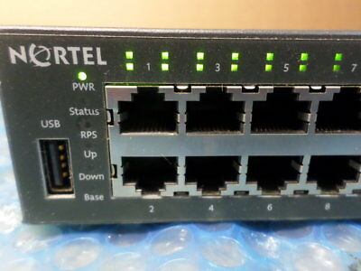
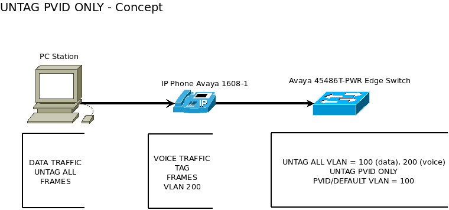

Avaya Nortel Ethernet Routing Switch
------------------------------------

.. note:: Esse é um guia rápido para os iniciantes se familiarizarem com os comandos básicos dos Switches da Nortel.

          - `Site oficial http://support.avaya.com/ <http://support.avaya.com/>`_ 
          211 Mt. Airy Road,Basking Ridge,NJ 07920 AVAYA

Dados fornecidos geralmente são o MAC ou IP e Vlan de cada Operação.

Acesso ao SW Cores (apenas vizualização não entrar no modo config). Procure localizar o SW de acesso da operação e conferir
sempre a porta (tag all) com o sys topology (nem todos os SW de acesso estão conectados nas portas padrão 49 e 50)
Uma vez localizado o Switch de acesso, acessar e verificar o status da porta, o Mac e as Vlans que estão passando na interface desse Switch.

1. Adicionar nova VLAN no SW Core
^^^^^^^^^^^^^^^^^^^^^^^^^^^^^^^^^

Configurar o SW IP 10.255.11.28 portas:45 e 46 na vlan-id: **101** (IP 10.221.64.0) e também as portas: 6, 9 ,17, 21 e 39 na vlan-id: **220** (IP 172.31.78.0).

Acesse o SW CORE (Avaya ERS-8806), digite o comando abaixo e tecle **ENTER**::

    CORETESTSW01# show ip arp info 10.255.11.28

    *******************************************************************************
    Command Execution Time: TUE JAN 28 09:58:58 2020 GMT
    *******************************************************************************

    ================================================================================
                             IP Arp - GlobalRouter
    ================================================================================
    IP_ADDRESS      MAC_ADDRESS        VLAN    PORT       TYPE    TTL(10 Sec)
    --------------------------------------------------------------------------------
    10.255.11.28    00:23:0d:03:68:00  255     3/7      DYNAMIC 1263

    CORETESTSW02# show ip arp info 10.255.11.28
    
    *******************************************************************************
    Command Execution Time: TUE JAN 28 10:00:09 2020 GMT
    *******************************************************************************

    ================================================================================
                             IP Arp - GlobalRouter
    ================================================================================
    IP_ADDRESS      MAC_ADDRESS        VLAN    PORT       TYPE    TTL(10 Sec)
    --------------------------------------------------------------------------------
    10.255.11.28    00:23:0d:03:68:00  255     1/39      DYNAMIC 295

Mostrar o IP da VLAN 220 e 101::
    
    CORETESTSW01# show vlan info ip 220
    CORETESTSW01# show vlan info ip 101

VLANS QUE ATUALMENTE ESTÃO PASSANDO PELA PORTA DO **CORE PRIMÁRIO** ONDE O SW ESTÁ CONECTADO::

    CORETESTSW01#  show ports info vlans port 3/7
    
    *******************************************************************************
    Command Execution Time: TUE JAN 28 09:50:06 2020 GMT
    *******************************************************************************

    ================================================================================
                                   Port Vlans
    ================================================================================
    PORT          DISCARD DISCARD   DEFAULT VLAN   UNTAG
    NUM   TAGGING TAGFRAM UNTAGFRAM VLANID  IDS    DEFVLAN
    --------------------------------------------------------------------------------
    3/7   enable  false   true      255     100 109 214 250 255 271 3138   disable

VLANS QUE ATUALMENTE ESTÃO PASSANDO PELA PORTA DO **CORE SECUNDÁRIO** ONDE O SW ESTÁ CONECTADO::

    CORETESTSW02# show ports info vlans port 1/39
    
    *******************************************************************************
    Command Execution Time: TUE JAN 28 10:00:55 2020 GMT
    *******************************************************************************

    ================================================================================
                                   Port Vlans
    ================================================================================
    PORT          DISCARD DISCARD   DEFAULT VLAN   UNTAG
    NUM   TAGGING TAGFRAM UNTAGFRAM VLANID  IDS    DEFVLAN
    --------------------------------------------------------------------------------
    1/39  enable  false   true      255     100 109 214 250 255 271 3138   disable

Mostra as vlans do Core e suas informações::

    CORETESTSW01# show ip interface

Há 8 VLANS atualmente cadastradas no SW de acesso **(IP 10.255.11.28)** mas nenhuma delas atendem as vlans 101 e 220::

    sw1.teste# show vlan
    
    Id   Name                 Type     Protocol         PID     Active IVL/SVL Mgmt
    ---- -------------------- -------- ---------------- ------- ------ ------- ----
    1    VLAN #1              Port     None             0x0000  Yes    IVL     No
            Port Members: NONE
    100  VLAN-10.220.11       Port     None             0x0000  Yes    IVL     No
            Port Members: 30-32,35,37-38,49-50
    109  VLAN_73              Port     None             0x0000  Yes    IVL     No
            Port Members: 1-29,33-34,38-50
    214  VLAN_172.31.173      Port     None             0x0000  Yes    IVL     No
            Port Members: 1-13,15-17,19-21,23-29,38-50
    250  VLAN-WIFI-MONICA     Port     None             0x0000  Yes    IVL     No
            Port Members: 36-37,49-50
    255  GER_BIDU             Port     None             0x0000  Yes    IVL     Yes
            Port Members: 49-50
    271  VLAN-271             Port     None             0x0000  Yes    IVL     No
            Port Members: 49-50
    3138 CORP-VOZ             Port     None             0x0000  Yes    IVL     No
            Port Members: 22,30-35,49-50
    Total VLANs: 8

Para adicionar 2 novas vlans no SW de Acesso, antes será necessário realizar ALTERAÇÔES em abos os CORES (Primário e Secundário). Depois em seguida TAGEAR VLAN PORT DO CORE de acordo com o tipo da vlan **(by port ou by srcmac)**. Muita calma nessa hora, pois em abientes de produção é necessário ter um bom planejamento por Gmud.

Acesse o SW CORE, digite o comando abaixo e tecle **ENTER**::

    CORETESTSW01# show vlan info basic 101
    
    *******************************************************************************
    Command Execution Time: WED JAN 29 03:55:15 2020 GMT
    *******************************************************************************

    ================================================================================
                                   Vlan Basic
    ================================================================================
    VLAN                              STG
    ID    NAME             TYPE         ID  PROTOCOLID SUBNETADDR      SUBNETMASK   
    --------------------------------------------------------------------------------
    101   VLAN - 64        byPort       1   none       N/A             N/A          

    CORETESTSW01# show vlan info basic 220
    
    *******************************************************************************
    Command Execution Time: WED JAN 29 03:55:20 2020 GMT
    *******************************************************************************

    ================================================================================
                                   Vlan Basic
    ================================================================================
    VLAN                              STG
    ID    NAME             TYPE         ID  PROTOCOLID SUBNETADDR      SUBNETMASK   
    --------------------------------------------------------------------------------
    220   VLAN - 172.31.78.0/24 - Magali bySrcMac     1   none       N/A             N/A

    CORETESTSW01# show vlan info advance 220
    
    ================================================================================
                                      Vlan Advance
    ================================================================================
    VLAN             IF    QOS   AGING MAC                USER
    ID    NAME       INDEX LVL   TIME  ADDRESS       DEFINEPID ENCAP  DSAP/                                                                                        
    --------------------------------------------------------------------------------

    220   VLAN - 172.31.78.0/24 - Magali 2268  1     600   3c:b1:5b:2d:22:3b  0x0000
    

    CORETESTSW01# show vlan info advance 101
    
    *******************************************************************************
    Command Execution Time: WED JAN 29 04:05:49 2020 GMT
    *******************************************************************************

    ================================================================================
                                  Vlan Advance
    ================================================================================
    VLAN             IF    QOS   AGING MAC                USER
    ID    NAME       INDEX LVL   TIME  ADDRESS            DEFINEPID ENCAP  DSAP/SSAP
    --------------------------------------------------------------------------------
    101   VLAN - 64  2149  1     0     3c:b1:5b:2d:22:0f  0x0000

A vlan 101 é By Port, portanto temos que adicionar Vlan-Id através da porta (BY PORT) em ambos os CORES::

    CORETESTSW01# vlan 101 ports add 3/7 member portmember
    CORETESTSW02# vlan 101 ports add 1/39 member portmember

A vlan 220 é By Source Mac, portanto temos que adicionar Vlan-Id através da porta (BY SRCMAC) em ambos os CORES::

    CORETESTSW01# vlan 220 ports add 3/7 member static 
    CORETESTSW02# vlan 220 ports add 1/39 member static 

Verificar as Vlans 101 e 220 nas portas em ambos os Cores::

    CORETESTSW01# show ports info vlans port 3/7
    
    *******************************************************************************
    Command Execution Time: WED JAN 29 07:49:07 2020 GMT
    *******************************************************************************

    ================================================================================
                                   Port Vlans
    ================================================================================
    PORT          DISCARD DISCARD   DEFAULT VLAN   UNTAG
    NUM   TAGGING TAGFRAM UNTAGFRAM VLANID  IDS    DEFVLAN
    --------------------------------------------------------------------------------
    3/7   enable  false   true      255     1 100 101 109 214 220 250 255 271 3138   disable

    CORETESTSW02# show ports info vlans port 1/39
    
    *******************************************************************************
    Command Execution Time: WED JAN 29 08:00:02 2020 GMT
    *******************************************************************************

    ================================================================================
                                   Port Vlans
    ================================================================================
    PORT          DISCARD DISCARD   DEFAULT VLAN   UNTAG
    NUM   TAGGING TAGFRAM UNTAGFRAM VLANID  IDS    DEFVLAN
    --------------------------------------------------------------------------------
    1/39   enable  false   true      255     1 100 101 109 214 220 250 255 271 3138   disable

Vamos realizar agora as alterações necessárias no SWITCH DE ACESSO **(IP 10.255.11.28)**.

Após ter realizado o tageamento vlan port nos CORES, agora vamos ajustar as Vlans 101 e 220 nas interfaces no SW de acesso.

OBS: No PVID a vlan padrão 101 e 220 ambas são vlan de dados (prioridade sempre é para o tráfego de dados).
 
Adicionar a VLAN-ID 101 nas Portas 46 e 45.::

    sw1.teste# conf t
    sw1.teste (config)# vlan members add 101 45-46
    sw1.teste (config)# vlan ports 45-46 pvid 101
    sw1.teste (config)# exit
    sw1.teste # save conf
    
    sw1.teste # show vlan
    sw1.teste# show vlan interface info 45,46

         Filter  Filter     Filter
         Tagged Untagged Unregistered
    Port Frames  Frames     Frames    PVID PRI    Tagging    Name
    ---- ------ -------- ------------ ---- --- ------------- ----------------
    45    No     No       No           101  0   UntagPvidOnly Port 45
    46    No     No       No           101  0   UntagPvidOnly Port 46    

Adicionar a VLAN-ID 220 nas Portas 6, 9, 17, 21 e 39::

    sw1.teste# conf t
    sw1.teste (config)# vlan members add 220 6,9,17,21,39
    sw1.teste (config)# vlan ports 6,9,17,21,39 pvid 220
    sw1.teste (config)# exit
    sw1.teste # save conf
    
    sw1.teste# show vlan
    sw1.teste# show vlan interface info 6,9,17,21,39

         Filter  Filter     Filter
         Tagged Untagged Unregistered
    Port Frames  Frames     Frames    PVID PRI    Tagging    Name
    ---- ------ -------- ------------ ---- --- ------------- ----------------
    06    No     No       No           220  0   UntagPvidOnly Port 06
    09    No     No       No           220  0   UntagPvidOnly Port 09
    17    No     No       No           220  0   UntagPvidOnly Port 17
    21    No     No       No           220  0   UntagPvidOnly Port 21 
    39    No     No       No           220  0   UntagPvidOnly Port 39 

Nos CORES (Primário e Secundário), deverão ser adicionados, obrigatoriamente, os MACs das estações na tabela SRCMAC da vlan 220. Veja o exemplo abaixo::

    CORETESTSW01# vlan 220 srcmac add 64:1c:67:9B:82:6B

Mostrar os macs adicionados na vlan que é srcmac::

    CORETESTSW01# show vlan info srcmac 220

2. Verificar o Switch 10.255.6.8 na porta 3 onde a mesma encontra-se bloqueada
^^^^^^^^^^^^^^^^^^^^^^^^^^^^^^^^^^^^^^^^^^^^^^^^^^^^^^^^^^^^^^^^^^^^^^^^^^^^^^

Mostrar as interfaces::

    sw6.cosmonaut# show interfaces link-down

                  Status                    Auto                        Flow
    Port Trunk Admin   Oper Link LinkTrap Negotiation  Speed   Duplex Control
    ---- ----- ------- ---- ---- -------- ----------- -------- ------ -------    
    3          Disable Down Down Enabled  Enabled     100Mbps  Full   Disable  
    
    sw6.cosmonaut# config t
    sw6.cosmonaut (config)# interface eth 3
    sw6.cosmonaut (config)# no shutdown
    sw6.cosmonaut# exit

    sw6.cosmonaut# show interfaces
        
                  Status                    Auto                        Flow
    Port Trunk Admin   Oper Link LinkTrap Negotiation  Speed   Duplex Control
    ---- ----- ------- ---- ---- -------- ----------- -------- ------ -------
    1          Enable  Up   Up   Enabled  Enabled     100Mbps  Full   Disable
    2          Enable  Up   Up   Enabled  Enabled     100Mbps  Full   Disable
    3          Enable  Up   Up   Enabled  Enabled     100Mbps  Full   Disable

    sw6.cosmonaut# show logs 

    MAC SECURITY EXCCED MACS
    
    sw6.cosmonaut# show mac-security port 3

Dar um reset na base Avaya e configurá-la na Vlan 182 (Voz), para que somente o Notebook esteja na Vlan 88 (dados):: 

    sw6.cosmonaut# show mac-address-table port 3
    
    Mac Address Table Aging Time: 300
    Learning Enabled Ports ALL
    Number of addresses: 2

       MAC Address    Vid   Type       Source
    ----------------- ---- ------- --------------
    64-1C-67-76-37-91   88 Dynamic Port: 3
    CC-F9-54-AA-E1-66   88 Dynamic Port: 3    
    
Mostar as Vlans configuradas na porta::

    sw6.cosmonaut# show vlan interface vids 3
    
    Port VLAN VLAN Name         VLAN VLAN Name         VLAN VLAN Name
    ---- ---- ----------------  ---- ----------------  ---- ----------------
    3    88   BV-DADOS_VOZ      182  CHUBB-Voz
    ---- ---- ----------------  ---- ----------------  ---- ----------------

3. Proceder com a desabilitação de alimentação POE do SW 10.221.99.7 porta 45
^^^^^^^^^^^^^^^^^^^^^^^^^^^^^^^^^^^^^^^^^^^^^^^^^^^^^^^^^^^^^^^^^^^^^^^^^^^^^

O Motivo principal é que o AP 10.255.7.4 já possui uma fonte de alimentação de energia. E o mesmo está oscilando com interfência na intensidade do sinal WIFI.

Para desativar o POE::

    sw4.cosmonaut# configure terminal
    sw4.cosmonaut (config)# interface fastethernet 45
    sw4.cosmonaut (config)# poe poe-shutdown port 45
    sw4.cosmonaut# exit

    sw4.cosmonaut# show poe-port-status 45
    
              Admin      Current                               Limit
    Port  Status     Status              Classification   (Watts)  Priority
    ----  -------    -----------------   --------------   -------  --------
    45    Disable    Disabled                  0          16       Low

Para ativar o POE::

    sw4.cosmonaut# configure terminal
    sw4.cosmonaut (config)# interface fastethernet 45
    sw4.cosmonaut (config)# no poe-shutdown port 45
    sw4.cosmonaut# exit

    sw4.cosmonaut# show poe-port-status 45

              Admin      Current                               Limit
    Port  Status     Status              Classification   (Watts)  Priority
    ----  -------    -----------------   --------------   -------  --------
    45    Enable     Enable                 0          16       Low

4. Efetuar a troca do IP 10.221.17.220 da estação, para a rede IP 10.64.x.x. Mac da estação: 64:31:50:ff:6c:6f
^^^^^^^^^^^^^^^^^^^^^^^^^^^^^^^^^^^^^^^^^^^^^^^^^^^^^^^^^^^^^^^^^^^^^^^^^^^^^^^^^^^^^^^^^^^^^^^^^^^^^^^^^^^^^^
    CORETESTSW01# show vlan info fdb-entry mac 64:31:50:ff:6c:6f
    CORETESTSW01# show ip arp info 10.221.17.220
    CORETESTSW01# show sys topology
    
Mostrar o IP das VLANs :
    
    CORETESTSW01# show vlan info ip 160,172,180,181
  
        
Conforme evidência o switch na qual o mac está conectado não possui vlans 160,172,180 e 181 do range 10.64.x.x.::

    CORETESTSW01# show ports info vlans port 1/6

Localizado o SW de acesso 10.221.18.8::

    sw7.cosmonault# show mac-address-table address 64:31:50:ff:6c:6f

    Mac Address Table Aging Time: 300
    Learning Enabled Ports 1/ALL,2/ALL,3/ALL
    Number of addresses: 1

       MAC Address     Vid    Type       Source
    -----------------  ----  -------  --------------
    64-31-50-FF-6C-6F   23   Dynamic  Unit:3  Port:1/31

    sw7.cosmonault# show vlan

    Id  Name                 Type     Protocol         User PID Active IVL/SVL Mgmt
    --- -------------------- -------- ---------------- -------- ------ ------- ----
    1   VLAN #1              Port     None             0x0000   Yes    IVL     No
            Port Members: NONE
    2   VLAN-17              Port     None             0x0000   Yes    IVL     No
            Port Members: 1/1-35,1/37-38,1/40-48,3/1,3/3,3/5-33,3/35-48
    3   VLAN-18              Port     None             0x0000   Yes    IVL     Yes
            Port Members: 1/6,1/8-9,1/12,1/24,1/32,1/34,1/36,1/39,1/45,1/47-48,
                          3/2-4,3/12-14,3/20,3/34
    16  Vlan-23              Port     None             0x0000   Yes    IVL     No
            Port Members: 1/47-48,3/23
    23  Vlan-28              Port     None             0x0000   Yes    IVL     No
            Port Members: 1/47-48,3/5,3/7,3/35
    35  Vlan-VOZ-NG          Port     None             0x0000   Yes    IVL     No
            Port Members: 1/2,1/27-28,1/46-48,3/37,3/39    
    
Favor manobrar o cabo da porta 1/31 do switch 10.221.18.8 para um switch que possua a vlan que deseja. Foi imediatamente remanejado para o switch 10.221.29.9 porta 43. Sendo assim alterar para a vlan 160 de range 10.64.160.0/24::

    sw8.cosmonault# show mac-address-table address 64:31:50:ff:6c:6f

Adicionar uma Vlan **160** que já existe no switch na porta **43**::    

    sw8.cosmonault# conf t
    sw8.cosmonault (config)# vlan members add 160 43
    sw8.cosmonault (config)# exit
    sw8.cosmonault# save conf

Mudar o Pvid da porta::
         
    sw8.cosmonault# conf t
    sw8.cosmonault (config)# vlan ports 43 pvid 160
    sw8.cosmonault (config)# exit
    sw8.cosmonault# save conf
            
    sw8.cosmonault# show vlan interface info 43
    
         Filter  Filter     Filter
         Tagged Untagged Unregistered
    Port Frames  Frames     Frames    PVID PRI    Tagging    Name
    ---- ------ -------- ------------ ---- --- ------------- ----------------
    43   No     No       No           160  0   UntagPvidOnly Port 43
  

Localizar no Core o Mac a4:1f:72:fa:ba:9c olhando Vlan por Vlan (mais trabalhoso). Ele útil quando não se sabe direito qual é o Mac do host que está conectado no switch de acesso.

Mostar todas as Vlans::

    CORETESTSW01# show vlan info all

Mostrar todos os Macs que estão na vlan 15::

    CORETESTSW01# show vlan info fdb-entry 15

    ================================================================================
    VLAN            MAC                                         QOS    SMLT
    ID   STATUS     ADDRESS            INTERFACE        MONITOR LEVEL  REMOTE
    --------------------------------------------------------------------------------
    15   learned    a4:1f:72:fa:d2:08  Port-3/14        false   1      false

    Mostrar todos os Macs que estão na vlan 20::

    ================================================================================
    VLAN            MAC                                         QOS    SMLT
    ID   STATUS     ADDRESS            INTERFACE        MONITOR LEVEL  REMOTE
    --------------------------------------------------------------------------------
    20   learned    a4:1f:72:fa:ba:9c  Port-3/43        false   1      false

Bem mais fácil ter que localizar pelo endereço Mac, não só por ser mais assertivo como também poupa-se um tempo considerável::

    CORETESTSW01# show vlan info fdb-entry mac a4:1f:72:fa:ba:9c

    ================================================================================
    VLAN            MAC                                         QOS    SMLT
    ID   STATUS     ADDRESS            INTERFACE        MONITOR LEVEL  REMOTE
    --------------------------------------------------------------------------------
    20   learned    a4:1f:72:fa:ba:9c  Port-3/43        false   1      false

    CORETESTSW01#  show sys topology

    *******************************************************************************
    Command Execution Time: TUE FEB 04 04:24:21 2020 GMT
    *******************************************************************************

    ================================================================================
                                    Topology Table
    ================================================================================
    Local                                                                           Rem
    Port  IpAddress       SegmentId MacAddress   ChassisType            BT LS  CS   Port
    --------------------------------------------------------------------------------
    3/14 10.221.20.6     0x000130  0018b0f7cba1 BayStack470-48T-PWR    12 Yes HtBt  1/48

5. Configurando LLDP na interface
^^^^^^^^^^^^^^^^^^^^^^^^^^^^^^^^^

.. note:: Favor realizar a alteração da Vlan prioritária da base Avaya, onde a mesma está pegando automaticamente a Vlan de voz 214. A Vlan correta é a 265.

MAC da base Avaya é **00-1B-4F-50-0D-5F**

MAC do PC que está conectado na base Avaya é **D0-94-66-A8-22-90** 

IP do PC é **10.221.65.10**

Localização do Switch de acesso no Core::

    CORETESTW001# show ports info vlans port 3/18

    *******************************************************************************
    Command Execution Time: THU JAN 02 10:12:58 2020 GMT
    *******************************************************************************

    ================================================================================
                                       Port Vlans
    ================================================================================
    PORT          DISCARD DISCARD   DEFAULT VLAN   UNTAG
    NUM   TAGGING TAGFRAM UNTAGFRAM VLANID  IDS    DEFVLAN
    --------------------------------------------------------------------------------
    3/18  enable  false   true      255     40 100 109 114 210 212 214 223 254 255 265 271 3138   disable

Localização do Mac da base Avaya no Switch de Acesso::

    sw04cascao# show mac-address-table address 00:1b:4f:50:0d:5f

    Mac Address Table Aging Time: 300
    Learning Enabled Ports ALL
    Number of addresses: 2

    MAC Address    Vid   Type       Source
    ----------------- ---- ------- --------------
    00-1B-4F-50-0D-5F   40 Dynamic Port:17
    00-1B-4F-50-0D-5F  214 Dynamic Port:17

Cadastrar a Vlan 265 na porta 17::

    sw04cascao# conf t
    sw04cascao (config)# vlan members add 265 17
    sw04cascao (config)# exit
    sw04cascao# save conf
     
    sw04cascao# show vlan interface VIDS 17

    Port VLAN VLAN Name         VLAN VLAN Name         VLAN VLAN Name
    ---- ---- ----------------  ---- ----------------  ---- ----------------
    17   40   Buraco_GAP-Dados    265  Buraco_GAP-Voz
    ---- ---- ----------------  ---- ----------------  ---- ----------------

O LLDP está forçando a Vlan 214, precisamos removê-la e depois adicionar a Vlan 265 na configuração da interface porta 17::

    sw04cascao# show running-config | i Ethernet

    interface Ethernet ALL
    lldp med-network-policies port 12,16 voice dscp 46 priority 6 tagging tagged vlan-id 265
    lldp med-network-policies port 17 voice dscp 46 priority 6 tagging tagged vlan-id 214
    lldp med-network-policies port 19,21,31,39,42 voice dscp 46 priority 6 tagging tagged vlan-id 265
    exit

    sw04cascao# conf t
    sw04cascao (config)# interterface fastEthernet 17
    sw04cascao (config)# no lldp med-network-policies port 17 voice dscp 46 priority 6 tagging tagged vlan-id 214
    sw04cascao (config)# lldp med-network-policies port 17 voice dscp 46 priority 6 tagging tagged vlan-id 265
    sw04cascao (config)# exit 
    sw04cascao# save conf

    sw04cascao# show lldp med-network-policies port 17
    sw04cascao# show running-config | i Ethernet
    
    interface Ethernet ALL
    lldp med-network-policies port 12,16-17,19,21,31,39,42 voice dscp 46 priority 6 tagging tagged vlan-id 265

6. Lentidão na Internet
^^^^^^^^^^^^^^^^^^^^^^^

.. note:: Dado apenas o IP da estação 10.221.12.45

    CORETESTW001# show ip arp info 10.221.12.45

    *******************************************************************************
    Command Execution Time: TUE JAN 07 10:41:21 2020 GMT
    *******************************************************************************
    ================================================================================
                                  IP Arp - GlobalRouter
    ================================================================================
    IP_ADDRESS      MAC_ADDRESS        VLAN    PORT       TYPE    TTL(10 Sec)
    --------------------------------------------------------------------------------
    10.221.12.45    d0:94:66:a8:3f:11  21      1/6      DYNAMIC 2148

    CORETESTW001# show vlan info basic 21

    *******************************************************************************
    Command Execution Time: TUE JAN 07 10:42:36 2020 GMT
    *******************************************************************************
    ================================================================================
                                       Vlan Basic
    ================================================================================
    VLAN                              STG
    ID    NAME             TYPE         ID  PROTOCOLID SUBNETADDR      SUBNETMASK
    --------------------------------------------------------------------------------
    21    Lobo-Guara 12   bySrcMac      1    none        N/A             N/A
 
    1 out of 835 ARP entries displayed

    CORETESTW001# show sys topology

    *******************************************************************************
    Command Execution Time: TUE JAN 07 10:43:14 2020 GMT
    *******************************************************************************
    ================================================================================
                                     Topology Table
    ================================================================================
    Local                                                                        Rem
    Port  IpAddress     SegmentId MacAddress   ChassisType          BT LS  CS   Port
    --------------------------------------------------------------------------------

    0/0  10.221.1.2      0x000000  0016ca1d1000 ERS8806                12 Yes HtBt  0/0
    1/2  10.221.1.7      0x000131  048a152bd801 ERS4550T-PWR           12 Yes HtBt  1/49
    1/4  10.221.7.6      0x000131  001f9a43d801 ERS4550T-PWR           12 Yes HtBt  1/49
    1/5  10.221.4.8      0x000132  801daa78cc01 ERS4550T-PWR           12 Yes HtBt  1/50
    1/6  10.221.4.7      0x000132  fc8399a7d801 ERS4550T-PWR           12 Yes HtBt  1/50
    1/9  10.221.3.7      0x000131  b4b017e9a801 ERS4550T-PWR           12 Yes HtBt  1/49
    1/10 10.221.3.6      0x000131  001f9a3d1401 ERS4550T-PWR           12 Yes HtBt  1/49
    1/11 10.221.3.8      0x000131  001f9a42d401 ERS4550T-PWR           12 Yes HtBt  1/49
    1/12 10.221.7.5      0x000131  048a152c7801 ERS4550T-PWR           12 Yes HtBt  1/49
    1/13 10.221.4.6      0x000130  0017d1a0f2e1 BayStack470            12 Yes HtBt  1/48
    1/14 10.221.4.11     0x000130  0017d1a69361 BayStack470-48T-PWR    12 Yes HtBt  1/48
    1/15 10.255.4.6      0x000131  001f0a713801 ERS4550T-PWR           12 Yes HtBt  1/49
    1/16 10.221.4.4      0x000131  048a151ed801 ERS4550T-PWR           12 Yes HtBt  1/49
    1/17 10.221.5.4      0x000131  001f9a351001 ERS4550T-PWR           12 Yes HtBt  1/49
    1/18 10.221.15.4     0x000119  001a8f4daf61 BayStack425-24         12 Yes HtBt  1/25
    1/20 10.221.5.6      0x000131  048a1537fc00 ERS4550T-PWR           12 Yes HtBt  1/49

    CORETESTW001# ping 10.221.4.7 -s

    PING 10.221.4.7: 56 data bytes
    64 bytes from 10.221.4.7: icmp_seq=0. time=1.149 ms
    64 bytes from 10.221.4.7: icmp_seq=1. time=0.991 ms
    64 bytes from 10.221.4.7: icmp_seq=2. time=1.019 ms
    64 bytes from 10.221.4.7: icmp_seq=3. time=1.178 ms
    64 bytes from 10.221.4.7: icmp_seq=4. time=1.335 ms
    64 bytes from 10.221.4.7: icmp_seq=5. time=1.015 ms
    64 bytes from 10.221.4.7: icmp_seq=6. time=1.040 ms
    64 bytes from 10.221.4.7: icmp_seq=7. time=1.135 ms
    64 bytes from 10.221.4.7: icmp_seq=8. time=1.018 ms
    64 bytes from 10.221.4.7: icmp_seq=9. time=1.110 ms
    64 bytes from 10.221.4.7: icmp_seq=10. time=1.001 ms
    64 bytes from 10.221.4.7: icmp_seq=11. time=1.033 ms
    64 bytes from 10.221.4.7: icmp_seq=12. time=1.126 ms
    64 bytes from 10.221.4.7: icmp_seq=13. time=1.057 ms
    64 bytes from 10.221.4.7: icmp_seq=14. time=1.100 ms
    64 bytes from 10.221.4.7: icmp_seq=15. time=0.979 ms
    64 bytes from 10.221.4.7: icmp_seq=16. time=1.123 ms
    64 bytes from 10.221.4.7: icmp_seq=17. time=1.018 ms
    64 bytes from 10.221.4.7: icmp_seq=18. time=1.012 ms
    64 bytes from 10.221.4.7: icmp_seq=19. time=1.023 ms
    64 bytes from 10.221.4.7: icmp_seq=20. time=1.262 ms
    64 bytes from 10.221.4.7: icmp_seq=21. time=0.984 ms
    64 bytes from 10.221.4.7: icmp_seq=22. time=1.905 ms
    64 bytes from 10.221.4.7: icmp_seq=23. time=1.008 ms
    64 bytes from 10.221.4.7: icmp_seq=24. time=1.000 ms
    64 bytes from 10.221.4.7: icmp_seq=25. time=1.099 ms
    64 bytes from 10.221.4.7: icmp_seq=26. time=1.036 ms
    64 bytes from 10.221.4.7: icmp_seq=27. time=1.123 ms

----10.221.4.7 PING Statistics----
34 packets transmitted, 34 packets received, 0% packet loss
round-trip (ms)  min/avg/max = 0.979/1.093/1.905

    CORETESTW001/show/ports/error# ?

 

Sub-Context:

Current Context:

 

    collision [port <value>]

    extended [port <value>]

    main [port <value>]

    ospf [port <value>]

    show-all [file <value>]

 

    CORETESTW001/show/ports/error# collision

*******************************************************************************

Command Execution Time: TUE JAN 07 10:52:51 2020 GMT

*******************************************************************************

 

================================================================================

                         Port Ethernet Collision Error

================================================================================

PORT  ------------------------------- COLLISIONS -------------------------------

NUM   SINGLE            MULTIPLE          LATE              EXCESSIVE

--------------------------------------------------------------------------------

1/1   0                 0                 0                 0

1/2   0                 0                 0                 0

1/3   0                 0                 0                 0

1/4   0                 0                 0                 0

1/5   0                 0                 0                 0

1/6   0                 0                 0                 0

1/7   0                 0                 0                 0

1/8   0                 0                 0                 0

1/9   0                 0                 0                 0

1/10  0                 0                 0                 0

1/11  0                 0                 0                 0

1/12  0                 0                 0                 0

1/13  0                 0                 0                 0

1/14  0                 0                 0                 0

1/15  0                 0                 0                 0

1/16  0                 0                 0                 0

 

    CORETESTW001/show/ports/error# collision port 1/6

    *******************************************************************************
    Command Execution Time: TUE JAN 07 10:53:27 2020 GMT
    *******************************************************************************
    ================================================================================
                         Port Ethernet Collision Error
    ================================================================================
    PORT  ------------------------------- COLLISIONS -------------------------------
    NUM   SINGLE            MULTIPLE          LATE              EXCESSIVE
    --------------------------------------------------------------------------------
    1/6   0                 0                 0                 0

    CORETESTW001/show/ports/error# ext port 1/6
    *******************************************************************************
    Command Execution Time: TUE JAN 07 10:53:55 2020 GMT
    *******************************************************************************
    ================================================================================
                              Port Ethernet Error Extended
    ================================================================================
    PORT  MAC_RX   MAC_TX   DEFER    PACKET   LINK     UNKNOWN  IN       OUT
    NUM   ERRORS   ERRORS   TX       ERRORS   INACTIV  PROTOS   FLWCTRL  FLWCTRL
    --------------------------------------------------------------------------------
    1/6   0        0        0        0        0        0       0        0

    CORETESTW001/show/ports/error# main port 1/6

    *******************************************************************************
    Command Execution Time: TUE JAN 07 10:54:03 2020 GMT
    *******************************************************************************
    ================================================================================
                                  Port Ethernet Error
    ================================================================================
    PORT  ERROR    ERROR    FRAMES   TOO      LINK     CARRIER  CARRIER  SQETEST
    NUM   ALIGN    FCS      LONG     SHORT    FAILURE  SENSE    ERRORS   ERRORS
    --------------------------------------------------------------------------------
    1/6   0        0        0        0        0        0        0        0

Verificar no SW de Acesso IP 10.221.4.7::

    sw0012magali# show mac-address-table address d0:94:66:a8:3f:11

    Mac Address Table Aging Time: 300
    Learning Enabled Ports ALL
    Number of addresses: 1

    MAC Address       Vid   Type       Source
    ----------------- ---- ------- --------------
    D0-94-66-A8-3F-11   21 Dynamic Port:11

    sw0012magali# show interfaces 11

                  Status                    Auto                        Flow
    Port Trunk Admin   Oper Link LinkTrap Negotiation  Speed   Duplex Control
    ---- ----- ------- ---- ---- -------- ----------- -------- ------ -------
11         Enable  Up   Up   Enabled  Enabled     100Mbps  Full   Disable

    sw0012magali# show log

    Type Time                          Idx  Src Message
    ---- ----------------------------- ---- --- -------
    I    2020-01-06 19:41:05 GMT-02:00 37855     Unauthorized connection attempt from IP address: 10.221.240.158 by TELNET.
    I    2020-01-06 19:41:05 GMT-02:00 37856     #1 Disallowed connection attempt from IP address: 10.221.240.158
    I    2020-01-06 19:46:05 GMT-02:00 37857     Unauthorized connection attempt from IP address: 10.221.240.158 by TELNET.
    I    2020-01-06 19:46:05 GMT-02:00 37858     #1 Disallowed connection attempt from IP address: 10.221.240.158
    I    2020-01-06 19:51:05 GMT-02:00 37859     Unauthorized connection attempt from IP address: 10.221.240.158 by TELNET.
    I    2020-01-06 19:51:05 GMT-02:00 37860     #1 Disallowed connection attempt from IP address: 10.221.240.158
    I    2020-01-06 19:56:05 GMT-02:00 37861     Unauthorized connection attempt from IP address: 10.221.240.158 by TELNET.
    I    2020-01-06 19:56:05 GMT-02:00 37862     #1 Disallowed connection attempt from IP address: 10.221.240.158
    I    2020-01-06 20:01:05 GMT-02:00 37863     Unauthorized connection attempt from IP address: 10.221.240.158 by TELNET.
    I    2020-01-06 20:01:05 GMT-02:00 37864     #1 Disallowed connection attempt from IP address: 10.221.240.158
    I    2020-01-06 20:06:05 GMT-02:00 37865     Unauthorized connection attempt from IP address: 10.221.240.158 by TELNET.
    I    2020-01-06 20:06:05 GMT-02:00 37866     #1 Disallowed connection attempt from IP address: 10.221.240.158
    I    2020-01-06 20:11:05 GMT-02:00 37867     Unauthorized connection attempt from IP address: 10.221.240.158 by TELNET.
    I    2020-01-06 20:11:05 GMT-02:00 37868     #1 Disallowed connection attempt from IP address: 10.221.240.158
    I    2020-01-06 20:16:05 GMT-02:00 37869     Unauthorized connection attempt from IP address: 10.221.240.158 by TELNET.
    I    2020-01-06 20:16:05 GMT-02:00 37870     #1 Disallowed connection attempt from IP address: 10.221.240.158
    I    2020-01-06 20:21:05 GMT-02:00 37871     Unauthorized connection attempt from IP address: 10.221.240.158 by TELNET.
    I    2020-01-06 20:21:05 GMT-02:00 37872     #1 Disallowed connection attempt from IP address: 10.221.240.158
    I    2020-01-06 20:26:05 GMT-02:00 37873     Unauthorized connection attempt from IP address: 10.221.240.158 by TELNET.
    I    2020-01-06 20:26:05 GMT-02:00 37874     #1 Disallowed connection attempt from IP address: 10.221.240.158
    I    2020-01-06 20:31:05 GMT-02:00 37875     Unauthorized connection attempt from IP address: 10.221.240.158 by TELNET.
    I    2020-01-06 20:31:05 GMT-02:00 37876     #1 Disallowed connection attempt from IP address: 10.221.240.158
    I    2020-01-06 20:36:05 GMT-02:00 37877     Unauthorized connection attempt from IP address: 10.221.240.158 by TELNET.
    I    2020-01-06 20:36:05 GMT-02:00 37878     #1 Disallowed connection attempt from IP address: 10.221.240.158
    I    2020-01-06 20:41:05 GMT-02:00 37879     Unauthorized connection attempt from IP address: 10.221.240.158 by TELNET.
    I    2020-01-06 20:41:05 GMT-02:00 37880     #1 Disallowed connection attempt from IP address: 10.221.240.158
    I    2020-01-06 20:46:05 GMT-02:00 37881     Unauthorized connection attempt from IP address: 10.221.240.158 by TELNET.
    I    2020-01-06 20:46:05 GMT-02:00 37882     #1 Disallowed connection attempt from IP address: 10.221.240.158
    I    2020-01-06 20:51:05 GMT-02:00 37883     Unauthorized connection attempt from IP address: 10.221.240.158 by TELNET.
    I    2020-01-06 20:51:05 GMT-02:00 37884     #1 Disallowed connection attempt from IP address: 10.221.240.158
    I    2020-01-07 09:33:23 GMT-02:00 38192     Link Down Trap for Port: 41
    I    2020-01-07 09:33:30 GMT-02:00 38193     Link Up Trap for Port: 41

7. Desbloqueio da porta 34 do switch sw016chicobento do rack 4 do andar térreo
^^^^^^^^^^^^^^^^^^^^^^^^^^^^^^^^^^^^^^^^^^^^^^^^^^^^^^^^^^^^^^^^^^^^^^^^^^^^^^

.. note:: Motivo - foi necessário fazer a movimentação de uma máquina (estação do colaborador).

Segundo a documentação, e de acordo com a topologia, identificamos o IP do SW 10.221.56.16::

    sw016chicobento# show interfaces

    Unit          Status                    Auto                        Flow
    Port Trunk Admin   Oper Link LinkTrap Negotiation  Speed   Duplex Control
    ---- ----- ------- ---- ---- -------- ----------- -------- ------ -------
    .
    .
    1/30       Enable  Up   Up   Enabled  Enabled     100Mbps  Full   Disable
    1/31       Enable  Down Down Enabled  Enabled
    1/32       Enable  Down Down Enabled  Enabled
    1/33       Enable  Up   Up   Enabled  Enabled     100Mbps  Full   Disable
    1/34       Disable Down Down Enabled  Enabled

    sw016chicobento# show stack-info

    Unit# Switch Model     Pluggable Pluggable Pluggable Pluggable SW Version
                             Port      Port      Port      Port
    ----- ---------------- --------- --------- --------- --------- ----------
    1     4550T-PWR        (49) None (50) Unsp                     v5.7.1.021
    2     4550T-PWR        (49) None (50) Unsp                     v5.7.1.021

    sw016chicobento# interface ethernet 1/34
    sw016chicobento (config)# no shut
    sw016chicobento (config)# exit
    sw016chicobento# save conf

    sw016chicobento# show interfaces 1/34

    Unit          Status                    Auto                        Flow
    Port Trunk Admin   Oper Link LinkTrap Negotiation  Speed   Duplex Control
    ---- ----- ------- ---- ---- -------- ----------- -------- ------ -------
    1/34       Enable  Up   Up   Enabled  Enabled     100Mbps  Full   Disable

8. AVAYA CORE VSP 4000 Command Line Reference
^^^^^^^^^^^^^^^^^^^^^^^^^^^^^^^^^^^^^^^^^^^^^

Localizar Mac no Core::

    COREVSPW005# show vlan mac-address-entry mac f8:bc:12:8e:b2:95
    COREVSPW005# show vlan mac-address-entry port
    COREVSPW005# show autotopology nmm-table

Localizar Mac no Core::

    CORETESTW001# show vlan info fdb-entry mac f8:bc:12:8e:b2:95

Informação da Vlan::

    CORETESTW001# show vlan info advance 44
    CORETESTW001# show vlan info basic 44

Descobrir os Macs atrelados a Vlan 100::

    CORETESTW001# show vlan info srcmac 100

Adicionar e forçar Mac passar na Vlan SRCMAC (BYMAC) em todos os Cores::

    CORETESTW001# vlan 100 srcmac add 5c:f9:dd:ec:a3:5c

Mostrar todos os Macs adicionados por srcmac de todas as Vlans::

    CORETESTW001# show vlan info srcmac

Achar o IP da Vlan::

    CORETESTW001# show vlan ip 100

Encontrar o Mac através do IP da Estação/Base::

    CORETESTW001# show ip arp info 10.221.79.68

Verificar Vlans que passam na porta::

    CORETESTW001# show ports info vlans port 3/40

Verificar qual MLT está amarrado na porta::

    CORETESTW001# show smlt

Detectar falha entre 2 interfaces ethernet fisicas (ponto a ponto)::

    CORETESTW001# show ports info vlacp port 1/16

Mostrar o escopo DHCP::

    CORETESTW001# show ip dhcp-relay fwd-path

Consumo de CPU::

    CORETESTW001# show cpu utilization

Mostrar todas as Vlans::

    CORETESTW001# show vlan info basic 44

Mostrar informação da porta::

    CORETESTW001# show ports info smlt port 3/40

Mostar Vlans que passam na porta::

    CORETESTW001# show ports info vlan port 1/43

Localizar as interfaces::

    CORETESTW001# show ip interface

Localizar o IP do switch de acesso:

    CORETESTW001# show sys topology

Verificar Logs de quedas::

    CORETESTW001# show log file tail

Reativar uma porta de um SW de acesso que perdeu a gerência (não pinga) e o mesmo antes estava conectado na porta 3/35::

.. note:: O SW Core pode derrubar uma porta de um SW de Acesso, a fim de evitar looping na rede. 

    CORETESTW001/config/ethernet/3/35# state disable
    CORETESTW001/config/ethernet/3/35# state enable

Verificar status de cada porta::

    CORETESTW001# show bpdu-filter

Resumo de quedas/erros::

    CORETESTW001# show log file tail severity ?
    CORETESTW001# how log file tail severity warning --> quedas recentes

Adicionar Vlan-id através da porta (BYPORT) (**atenção** - somente com janela de gmud)::
 
    CORETESTW001#  vlan 173 ports add 3/35 member portmember

Adicionar Vlan-id através da porta (BY SRCMAC) (**atenção** - somente com janela de gmud)::

    CORETESTW001#  vlan 212 ports add 1/41 member static

Tagear Vlan port do Core (**atenção** - somente com janela de gmud)::

    CORETESTW001# config ethernet 1/43 perform-tagging enable
    CORETESTW001# show ports info vlan port 1/43

Adicionar uma Vlan Default (padrão)::

    CORETESTW001# config ethernet 1/43 default-vlan-id 109

Resumo de status da porta::

    CORETESTW001# show ports info state port 1/4

Estatísticas da porta::

    CORETESTW001# show ports stats bridging port 2/13

Colisão e erro da porta::

    CORETESTW001# show ports error collision port 2/13

Erro na porta::

    CORETESTW001# show ports error ext port 2/13

Erro principal na porta::

    CORETESTW001# show ports error main port 2/13

Limpar dados da porta::

    CORETESTW001# clear ports stats 2/13

Saltos::

    CORETESTW001# traceroute 10.221.28.5

Ping estendido do Core para o switch de acesso::

    CORETESTW001# ping -s 10.221.28.5

9. SW de Acesso - Command Line Reference
^^^^^^^^^^^^^^^^^^^^^^^^^^^^^^^^^^^^^^^^

Verifica IP de cada Vlan::

    sw04cascao# show vlan ip

Localiza posição do Mac::

    sw04cascao# show mac-address-table adress cc-f9-54-a5-01-e6

Resumo de todas as Vlans::

    sw04cascao# show vlan summary

Descrição de todas as Vlans::

    sw04cascao# show vlan

Verificar status da porta 39::

    sw04cascao# show vlan interface info 39

Mostrar as interfaces que estão desabilitadas::

    sw04cascao# show interface link-down

Exibe o modelo do equipamento::

    sw04cascao# show stack-info

Mostra o tempo em atividade que o SW está ligado::

    sw04cascao# show stack info uptime

Mostra a topologia do equipamento (uplinks)::

    sw04cascao# show autotopology nmm-table

MOstra todos os endereços Macs::

    sw04cascao# show mac-address-table

Mostra a Tabela Arp::

    sw04cascao# show arp-table

Informação de Vlan específica::

    sw04cascao# show vlan vid 104

Localizar Mac e Vlan através da porta::

    sw04cascao# show mac-address-table port 13

MOstra a prioridade e saída da porta (PVID)::

    sw04cascao# show vlan info

Limpa Tabela Mac::

    sw04cascao# clear mac-address-table address 5c:f9:dd:ec:ab:ae

Consulta IPs para amarração::

    sw04cascao# show ip

Verificar status da LLDP na porta::

    sw04cascao# show lldp port 41

Exibir o processamento da CPU::

    sw04cascao# show cpu-utilization

Exibir memória utilizada::

    sw04cascao# show memory-utilization

Exibir estatísticas do uplink (erros)::

    sw04cascao# show port-statistics port 49-50

Exibir estatísticas da porta (erros)::

    sw04cascao# show port-statistics

Exibir configuração geral::

    sw04cascao# show running-config

Como configurar um novo switch de acesso
^^^^^^^^^^^^^^^^^^^^^^^^^^^^^^^^^^^^^^^^

.. note:: Tendo em vista o crescimento operacional, segue os dados para a configuração do novo switch.

(Switch de Acesso)

Nome: Giuliana
Rede: Vlan ID 143 – 10.15.143.0/24
Cascade: 10.255.7.4 porta 6
Hostname: SW017GIULIANA
IP Gerencia: 10.255.7.7
Espelhar as configurações do switch 10.255.7.6

Segue as configurações de exemplo::

    SW017GIULIANA# show running-config
    ! Embedded ASCII Configuration Generator Script
    ! Model = Ethernet Routing Switch 4550T-PWR
    ! Software version = v5.7.1.021
    !
    ! Displaying only parameters different to default
    !================================================
    enable
    configure terminal
    !
    ! *** CORE (Phase 1) ***
    !
    sntp server primary address 10.221.240.10
    sntp server secondary address 10.221.230.10
    sntp enable
    sntp sync-interval 3
    radius server host 10.221.242.19
    ! radius server host key ********
    radius reachability use-radius
    telnet-access inactive-timeout 6
    terminal width 132
    cli password serial local
    ! cli password telnet radius
    !
    ! *** SNMP ***
    !
    snmp-server enable
    snmp-server name "SW017GIULIANA"
    snmp-server location "Mt Airy Road Basking Ridge"
    no snmp-server notification-control lldpRemTablesChange
    no snmp-server notification-control lldpXMedTopologyChangeDetected
    !
    ! *** IP  ***
    !
    ip default-gateway 10.255.7.4
    ip address switch 10.255.7.7
    !
    ! *** IP Manager ***
    !
    telnet-access disable
    web-server disable
    no ipmgr web
    ipmgr source-ip 1 10.221.240.158 mask 255.255.255.255
    ipmgr source-ip 2 10.221.240.170
    ipmgr source-ip 3 10.221.240.109
    ipmgr source-ip 4 10.221.240.110
    ipmgr source-ip 5 10.221.230.110
    ipmgr source-ip 6 10.221.241.42
    ipmgr source-ip 7 10.221.242.224
    ipmgr source-ip 8 10.221.242.225
    !
    ! *** ASSET ID ***
    !
    !
    ! *** IPFIX ***
    !
    !
    ! *** System Logging ***
    !
    logging remote address 10.221.242.139
    logging remote enable
    logging remote level serious
    !
    ! *** STACK ***
    !
    !
    ! *** Custom Banner ***
    !
    banner disabled
    !
    ! *** SSH ***
    !
    ssh
    !
    ! *** SSL ***
    !
    ssl
    !
    ! *** SSHC ***
    !
    !
    ! *** RSTP (Phase 1) ***
    !
    !The Spanning tree operation mode cannot be changed without rebooting.
    !The Spanning tree operation mode is required to be set to RSTP before
    !loading this ASCII configuration file.
    spanning-tree mode rstp
    !
    ! *** LACP (Phase 1) ***
    !
    !LACP mode is set to OFF on all interfaces to enable manipulation of
    !ports with LACP enabled
    interface Ethernet ALL
    lacp mode port ALL off
    exit
    !
    ! *** VLAN ***
    !
    vlan create 143,255 type port
    vlan name 143 "GIULIANA_Dados"
    vlan name 255 "VLAN_DMC"
    vlan ports 1-48 tagging unTagPvidOnly
    vlan ports 49-50 tagging tagAll filter-untagged-frame enable
    vlan configcontrol flexible
    vlan members 1 NONE
    vlan members 143 ALL
    vlan members 255 49-50
    vlan ports 1-48 pvid 143
    vlan ports 49-50 pvid 255
    no auto-pvid
    !
    ! *** EAP ***
    !
    !
    ! *** EAP Guest VLAN ***
    !
    !
    ! *** EAP Fail Open VLAN ***
    !
    !
    ! *** EAP Voip VLAN ***
    !
    !
    ! *** 802.1ab ***
    !
    !
    ! *** 802.1ab vendor-specific Avaya TLVs config ***
    !
    !
    ! *** 802.1AB MED Voice Network Policies ***
    !
    !
    ! *** QOS ***
    !
    !
    ! *** RMON ***
    !
    !
    ! *** Interface ***
    !
    !
    ! *** Rate-Limit ***
    !
    interface Ethernet ALL
    rate-limit port 1-48 both 5
    exit
    !
    ! *** MLT (Phase 1) ***
    !
    !
    ! *** MAC-Based Security ***
    !
    interface Ethernet ALL
    mac-security port 1-48 enable
    mac-security auto-learning port 1-48 enable
    exit
    mac-security enable
    mac-security intrusion-detect forever
    mac-security filtering enable
    !
    ! *** LACP (Phase 2) ***
    !
    !
    ! *** ADAC ***
    !
    !
    ! *** RSTP (Phase 2) ***
    !
    interface Ethernet ALL
    spanning-tree rstp port 49-50 learning disable
    spanning-tree rstp port 1-48 edge-port true
    spanning-tree bpdu-filtering port 1-48 enable timeout 0
    exit
    !
    ! *** Port Mirroring ***
    !
    !
    ! *** VLAN Phase 2***
    !
    vlan DMC 255
    !
    ! *** MLT (Phase 2) ***
    !
    !
    ! *** PoE ***
    !
    !
    ! *** RTC ***
    !
    clock time-zone BRT -3 0
    !
    ! *** Avaya Energy Saver ***
    !
    !
    ! *** AUR ***
    !
    !
    ! *** AAUR ***
    !
    !
    ! *** L3 ***
    !
    !
    ! --- ECMP ---
    !
    ! No license for ECMP.
    ! Contact support@avaya.com to update Software license.
    !
    ! *** Brouter Port ***
    !
    !
    ! *** CORE (Phase 2) ***
    !
    !
    ! *** IPV6 ***
    !
    !
    ! *** VLACP ***
    !
    !
    ! *** DHCP Relay ***
    !
    !
    ! *** L3 Protocols ***
    !
    !
    ! --- IP Directed Broadcast ---
    !
    !
    ! --- Proxy ARP ---
    !
    !
    ! --- UDP Broadcast Forwarding ---
    !
    !
    ! --- VRRP ---
    !
    !
    ! --- Route Policies ---
    !
    !
    ! --- OSPF ---
    !
    router ospf
    router-id 154.62.20.0
    exit
    !
    ! --- RIP ---
    !
    !
    ! *** DHCP SNOOPING ***
    !
    ip dhcp-snooping
    ip dhcp-snooping vlan 143
    interface Ethernet ALL
    ip dhcp-snooping port 49-50 trusted
    exit
    !
    ! *** ARP INSPECTION ***
    !
    !
    ! *** IP SOURCE GUARD ***
    !
    !
    ! *** IGMP ***
    !
    !
    ! *** STACK MONITOR ***
    !
    !
    ! *** SLPP-guard ***
    !
    interface Ethernet ALL
    slpp-guard port 1-48 enable timeout 0
    exit
    !
    ! *** SLAMON ***
    !
    !
    ! *** LINK STATE TRACKING ***

Tagging, TagAll, UntagAll, TagPvidOnly e UntagPvidOnly
^^^^^^^^^^^^^^^^^^^^^^^^^^^^^^^^^^^^^^^^^^^^^^^^^^^^^^

.. note:: Iniciaremos com o conceito 'UntagPvidOnly' para o correto funcionamento do tráfego de dados dos PCs e tráfego de voz em bases de IP Phone Avaya.

