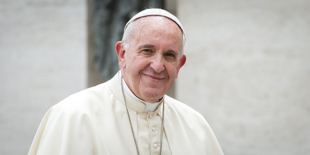
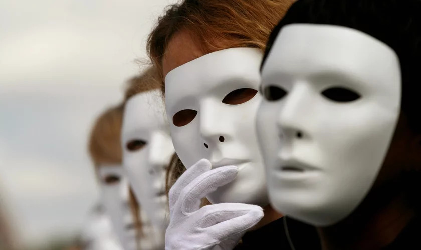

Papa Francisco volta a afirmar que prefere ateus aos católicos hipócritas
=========================================================================

Em sua primeira audiência de 2019, o papa Francisco disse que **é melhor ser ateu que católico hipócrita**.

Algumas expressões fortes do papa Francisco na audiência geral na quarta-feira (2 de janeiro de 2019) deram origem a uma audaciosa comparação entre 'cristãos hipócritas' e 'ateus'.

Na realidade, o papa insistiu sobretudo na incoerência daquele que 'frequenta a igreja... e depois vive odiando os outros'. É para ele que seria 'melhor não ir à igreja: viver assim, como se fosse um ateu! '

A ênfase da exortação papal não recai tanto no comportamento mais ou menos correto daqueles que se professam ateus e sua comparação com a coerência de vida dos crentes, mas sim sobre a intolerável hipocrisia religiosa de quem é 'capaz de tecer orações ateias, sem Deus'. E que fique bem entendido o papa está dizendo: há quem reza sem se sentir diante de Deus, sem escutar Deus, sem ser verdadeiramente tocado pela presença e pela voz de Deus.

A condenação da hipocrisia, um vício típico das pessoas religiosas de todos os tempos, é uma das advertências mais presentes já nos profetas de Israel, enquanto nos Evangelhos é um dos traços mais marcantes da pregação de Jesus. Por essa razão, retomála hoje, aplicandoa aos comportamentos daquele que não segue a fé que professa, mas a exterioridade das aparências, é simples atualização do ensinamento de Jesus.

Naquelas 'orações ateias'  expressão inédita, mas de rara eficácia o papa Francisco denuncia orações, liturgias, gestos religiosos em que Deus é nomeado e invocado, mas na realidade, ignorado. E ao chamar em causa o ateu coerente com os seus princípios, com a sua consciência, Francisco reconhece que quem se professa ateu e segue a sua consciência é mais correto de quem se diz cristão, mas tem um coração duplo e vive em hipocrisia.

A dura advertência do papa lembra a todos, começando justamente por aquele que se professa cristão, uma dimensão constante da doutrina católica: o princípio último permanece a consciência autêntica, comprovada e comparada de cada um, que é superior a qualquer autoridade e qualquer lei.

Precisamente por isso o papa Francisco aproxima tantas vezes a hipocrisia com a corrupção: se outros pecados 'chamam' para a conversão, a hipocrisia e a corrupção tendem, por sua natureza, a sufocar a consciência, a silenciá-la, a violentá-la em sua dimensão mais íntima. É então verdadeiro motivo de 'escândalo' assumir a postura de pessoa de oração e depois não amar o próximo, fingir dialogar na oração com o 'Deus que não pode ser visto' e desprezar 'o irmão que pode ser visto'. Então melhor viver 'como ateu', sem professar a fé cristã, em vez de contradizer com o comportamento o que se professa com os lábios.

O papa mais uma vez confessa que os cristãos caem em pecado como os outros, reafirma que as bem-aventuranças proclamadas por Jesus não são moralismo, mas boas novas e revelação.

Na catequese sobre o 'Pai Nosso', o papa Francisco não apresentou nenhum convite ao ateísmo, mas expressou novamente uma forte condenação da hipocrisia daqueles que usam atitudes e até a oração cristã como símbolos a serem ostentados, como auto-celebrações identitárias, mas permanecem incoerentes com a mensagem do Evangelho, alimentando em si a indiferença, se não o ódio pelos pobres e sofredores, a hostilidade para com aqueles que são diferentes e estrangeiros.

É por isso que esta foi uma exortação do papa Francisco apaixonada e convincente para crentes e não crentes, para pessoas 'pensantes' de qualquer ou nenhuma filiação religiosa. O papa Francisco simplesmente recordou a expressão do grande padre da igreja, 'Inácio de Antioquia': 'Melhor ser cristão sem dizê-lo e exibi-lo em vez de proclamar-se cristão sem sê-lo'.

Santos e Pecadores
==================

.. figure:: pecado.jpg
    :scale: 80 %
    :align: center
    :alt: O bem que quero não faço, mas o mau que não quero, esse faço.

Outro dia fulano conversava com beltrano acerca de um aspecto da concupiscência humana. Detalhe: -Essa pessoa é cristã. O que ela defendia? Bem resumidamente, é que o cristão após sua conversão vai deixando de pecar cada vez mais, até que em certo ponto ele não mais pecará, ou então isso se tornará algo extremamente acidental em sua vida. Me lembrou muito a doutrina da 'perfeição cristã', defendida por John Wesley (clérigo anglicano e teólogo cristão britânico, líder precursor do movimento metodista).

Entretanto as coisas não funcionam assim. Por dois motivos básicos:

* Primeiro, se fosse possível atingir esse estágio espiritual, **Cristo** sequer precisaria ter se sacrificado por mim, pois eu mesmo poderia ser salvo por meio de minhas próprias obras, logo nem eu e muito menos você, precisaríamos de sua graça.

* O segundo motivo que me leva a crer que a vida cristã não funciona assim é o fato de que quando olho para dentro de mim sempre encontro aquele velho dilema paulino: 'O bem que quero não faço, mas o mau que não quero, esse faço'. 

A premissa da qual o colega estava partindo é equivocada, muito embora seja comum entre muitos cristãos, qual seja, a de que quando somos alcançados pela graça divina deixamos de ser pecadores. Na verdade, mesmo após a conversão continuaremos a ser sempre, como dizia Lutero, 'santos e pecadores'.

Se dependesse apenas da vontade do homem, este realmente jamais se alteraria em situação alguma, nunca teria nenhum desejo 'carnal' reprovável, e tenderia à jamais mentir, jamais ter inveja, ou ter ira, jamais se abater ou desanimar e etc. Entretanto, Por quê vez ou outra me pego a infrigir todas essas situações? e então suplico: 'Pobre e miserável homem que sou, quem me livrará do corpo dessa morte?' A resposta a essa pergunta é fundamental, pois caso a respondamos equivocadamente estaremos expostos a uma das maiores neuroses de todos os tempos, a saber, o eterno sentimento de culpa e fracasso provocado pelo pecado. A única resposta plausível para a pergunta paulina é a que ele mesmo dá: 'Dou graças a Deus por Jesus Cristo, nosso Senhor'. Essa deve ser nossa resposta.

Nós jamais deixaremos de pecar, por mais que nos esforcemos. Aliás, se insistirmos demasiadamente nisso como algo fundamental, corremos o risco de nos tornar pessoas intolerantes consigo mesma e com o próximo, ou seja aqueles que estão ao nosso redor. Conseqüentemente a vida tornar-se-á um eterno suplício. É uma pena que tantos cristãos em nossos dias, assim como aconteceu desde sempre na história da igreja, sofram dessa neurose. Mas principalmente por se esquecerem que foi justamente para nos libertar dela que Cristo morreu na cruz.

Isso não significa que agora podemos pecar inconseqüentemente, o que seria uma redução ad absurdum infantil, tal qual os romanos poderiam fazer, na visão de Paulo **(Romanos 6.1)**. Aliás, o pecado machuca, e muito, nosso espírito, coisa que não acontece com o pecador indolente. Contudo, acredito que a vida seja curta demais para ficarmos perdendo tempo com essa psicose antropocêntrica.  Ser ou não pessoas melhores, não dependerá de nosso esforço, mas sobretudo de uma profunda e gradual compreensão da graça de Deus.

Pensa o contrário? Então experimente não pecar? Diga a si mesmo com toda convicção, -'Jamais pecarei novamente'! Acredite, mais cedo ou tarde irá falhar e inevitavelmente, se afundará na própria decepção. É como cavar sua própria cova... 'O pecado jaz à porta, e sobre ti será o seu desejo, mas sobre ele deves dominar', disse Deus à Caim. A nossa triste condição de pecadores serve mais como uma espécie de 'espinho na carne' de modo que jamais nos esquecemos da graça de Deus em nossa vida. Essa condição reforça nossa fé em Cristo porque na realidade não somos perfeitos e absolutos como o Criador. Cada um de nós, ainda carrega dentro de si algum grau de escuridão, do contrário porque necessitaríamos da salvação, da luz divina, ou de ter que ir à igreja, louvar à Deus, e ou abraçar uma religião?

    
    
    
    

