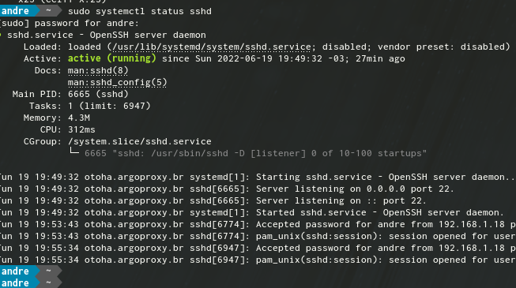
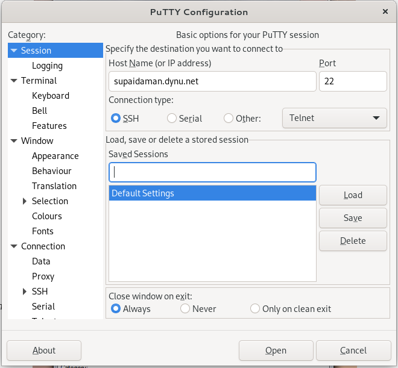
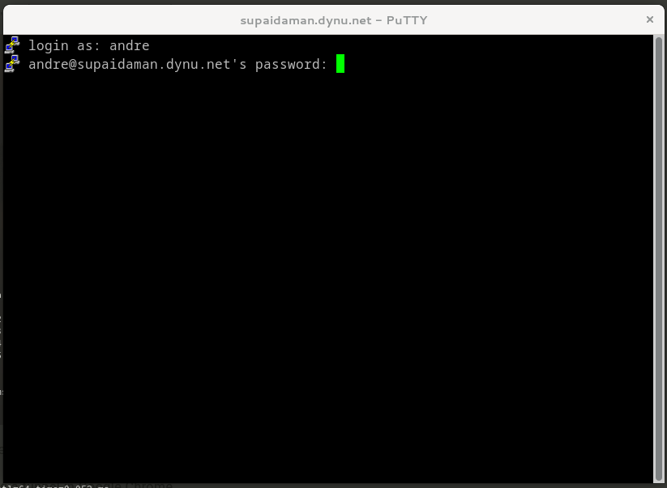
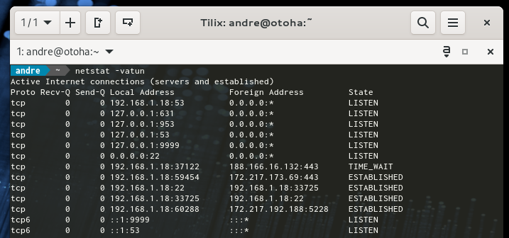

SUPAIDAMAN SSH TUNNEL
---------------------

.. note:: É raro precisar apelar p/ um singelo túnel para passar todo nosso tráfego web através de algum servidor externo. Pode até parecer ridículo, mas vez ou outra, nós costumamos fazer isso na surdina. Principalmente quando nos deparamos com as limitações do provedor de internet ou também quando necessitamos urgentemente de entrar em páginas, que normalmente não temos acesso. Isso pode ocorrer devido a um bloqueio de proxy server ou webfilter de algum firewall e pior acontece de repente, sem nenhum aviso prévio.. ou seja num belo dia vc perde o acesso à página e fim de história. Neste breve tutorial, mostrarei como burlar esses bloqueios e ainda fazer isso rapidamente de forma eficiente, usando apenas a ferramenta PuTTY (SSH) e o navegador Chrome.

    
**Baixe a versão mais atualizada do putty.exe** (free SSH and Telnet client) - pelo site oficial: `www.putty.org <https://www.chiark.greenend.org.uk/~sgtatham/putty/latest.html>`_     
    
Configuração básica do Putty
^^^^^^^^^^^^^^^^^^^^^^^^^^^^

Antes de mais nada, segue o comando para carregar o server ssh no servidor remoto (externo), aqui eu usarei o fedora linux como exemplo (sobre configuração do server ssh no linux, ficarei devendo pois isso vai além do escopo desse tutorial)::
 
    # systemctl start sshd

Agora no desktop windows, abra o **putty.exe** e entre com o IP ou a URL do seu servidor remoto (externo) ou desktop doméstico remoto (externo), por exemplo a url:: **supaidaman.dynu.net** sempre resolverá para mim p/ um IP dinâmico aleatório 179.55.x.x na porta 22. Esse IP é entregue pelo meu provedor de internet.

No lado esquerdo do painel do putty, vá p/ Connection → SSH → Tunnels

Agora siga as etapas:: selecione **Dynamic**, preencha a porta de origem (source port) por exemplo 9999, mas caso queira pode-se usar qualquer outra porta livre e depois click no botão **Add**

Na figura abaixo irá aparecer listado com o formato D{PORT_NUMBER} ou seja **D9999** 

.. figure:: putty-02.png
    :scale: 80 %
    :align: center
    :alt: putty.exe

Agora para finalizar clique no botão **Open**

Em seguida pode se logar no servidor remoto (externo), como de costume

    
Abra o **cmd** e com o comando netstat veja se o seu SSH está em modo LISTEN na porta 9999 **(127.0.0.1:9999)**

Usando um túnel no Google Chrome
^^^^^^^^^^^^^^^^^^^^^^^^^^^^^^^^

Finalmente chegamos meus caros, na parte mais crucial da configuração! 😛 yeah! Bora configurar o proxy no Chrome! Não é algo tão intuitivo igual o Firefox ou IE, porque quando queremos configurá-lo no Chrome pela GUI dele, infelizmente ele nos redireciona para o maldito Painel de Controle\Rede do Windows. Como não desejamos alterar a configuração de todo o PC, mas apenas do navegador Chrome. Por isso se faz necessário proceder de outra maneira, através do **command prompt** cmd::

    "C:\Program Files (x86)\Google\Chrome\Application\chrome.exe" --proxy-server="socks5://127.0.0.1:9999"

Se o comando não funcionar, pode ser devido seu google chrome estar instalado em outro local diferente **(C:\Program Files\Google\Chrome)**

Se tudo der certo o chrome abrirá e você pode validar através do endereço **http://httpbin.org/ip** e ver seu ip::

  {
  "origin": "179.55.170.40"
  }

Aqui por exemplo a resposta foi o IP usado pelo meu provedor de internet. 

Uhhhhuuuuuuuuu!  \😛/ Meus parabéns ^^  agora vc pode navegar livremente via tunel ssh! 

.. note:: Para ficar melhor ainda Pessoal, não esqueça de colocar o número da porta corretamente ok? Lembrem-se que aqui eu usei 9999, porém você pode usar outra que quiser, MAS É IMPORTANTE utilizar o mesmo número de porta nas configurações do PuTTY e do Chrome. Melhoria contínua sempre, vamo que vamo!

